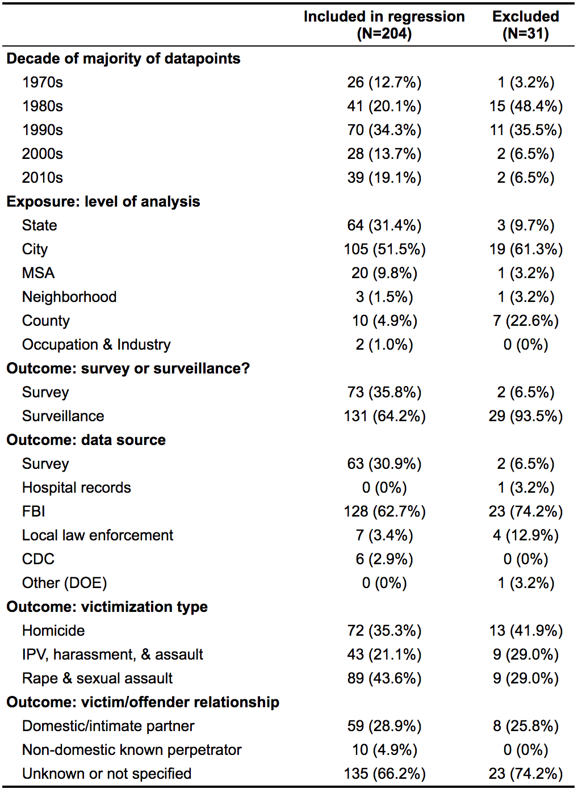

```{r setup, include=FALSE}
knitr::opts_chunk$set(echo = TRUE)
```

## Step 1: Import & clean data

<details>
<summary> Click to expand and see the initial data import and cleaning steps & full table from the data extraction form. </summary>

```{r libraries, echo=TRUE, output='hide', warning=FALSE, message=FALSE}
library(tidyverse)
library(metafor)
library(clubSandwich)
library(robumeta)
library(kableExtra)
library(table1)
library(mice)
library(mitools)

set.seed(8929) #set a random seed for reproducibility 
```

**Import data, making sure everything is the correct data type.**

```{r}
all_data = read_csv("Data/SecondDraft7-4-21.csv",
                      # up to outcome + up to exposure_reliability + the rest
                      col_types = paste0("nnccccfffccffcfffcncccc", "ffffffffffffffllcllllclfc", "fccccfnnnnllnnncnnnlflcc"))
```

**Fill in information in columns that are aggregates of others.**

```{r}
domestic_perpetrator_strings = c("husband",
                                 "Family violence",
                                 "family",
                                 "Intimate partner",
                                 "IPV")

non_domestic_known_perpetrator_strings = c("known nonintimate",
                                           "acquaintance",
                                           "friend")


all_data = all_data %>% 
  group_by(Study_ID) %>% 
  mutate(Combined_survey_surveillance = paste0(unique(Survey_surveillance), collapse = " & "),
         Combined_outcome_data_source = paste0(unique(Outcome_data_source), collapse = " & "),
         Combined_exposure_level = paste0(unique(Exposure_level), collapse = " & "),
         Combined_outcome_type_factor = paste0(unique(Outcome_type_factor), collapse = " & "),
         Num_EMs_from_this_study = length(unique(Effect_ID))
  ) %>% 
  ungroup() %>% 
  mutate(Exposure_category_economic = Exposure_category_employment | Exposure_category_financial,
         Exposure_combo = (as.integer(!is.na(Exposure_labor_force_participation)) +
                             as.integer(!is.na(Exposure_employment_unemployment)) +
                             as.integer(!is.na(Exposure_income)) +
                             as.integer(!is.na(Exposure_management_professional_roles))+
                             as.integer(!is.na(Exposure_women_owned_businesses)) +
                             as.integer(!is.na(Exposure_education)) +
                             as.integer(!is.na(Exposure_poverty)) +
                             as.integer(!is.na(Exposure_representation_in_government)) +
                             as.integer(!is.na(Exposure_voter_registration_civic_participation)) +
                             as.integer(!is.na(Exposure_maternal_mortality)) +
                             as.integer(!is.na(Exposure_teen_pregnancy)) +
                             as.integer(!is.na(Exposure_other_health_outcomes)) +
                             as.integer(!is.na(Exposure_women_legal_rights))) > 1,
         Unadjusted = Confounders == "NONE (UNADJUSTED)",
         Victimization_type = as.factor(
           case_when(Outcome_type_factor %in% c("Intimate partner homicide",
                                                "Female homicide") ~ "Homicide",
                     Outcome_type_factor %in% c("Rape",
                                                "Sexual assault") ~ "Rape & sexual assault",
                     Outcome_type_factor %in% c("Assault",
                                                "IPV",
                                                "Family violence",
                                                "Harassment") ~ "IPV, harassment, & assault",
                     TRUE ~ "999")),
         Perpetrator_relationship = as.factor(
           case_when(str_detect(Outcome, paste0(domestic_perpetrator_strings, collapse = "|")) ~ "Domestic/intimate partner",
                     str_detect(Outcome, paste0(non_domestic_known_perpetrator_strings, collapse = "|")) ~ "Non-domestic known perpetrator",
                     TRUE ~ "Unknown or not specified")),
         Exposure_level_condensed = as.factor(
           case_when(Exposure_level %in% c("City", "MSA") ~ "City/MSA",
                     Exposure_level %in% c("County") ~ "County",
                     Exposure_level %in% c("State") ~ "State",
                     TRUE ~ "999")),
         Race = as.factor(
           case_when(str_detect(Outcome, "White") ~ "White",
                     str_detect(Outcome, "Black") ~ "Black",
                     TRUE ~ "999"))
  ) %>% 
  group_by(Study_ID) %>% 
  mutate(Combined_exposure_types = paste0(c(rep("Economic", min(sum(Exposure_category_economic, na.rm = TRUE), 1)),
                                            rep("Education", min(sum(Exposure_category_education, na.rm = TRUE), 1)),
                                            rep("Political representation", min(sum(Exposure_category_political, na.rm = TRUE), 1)), 
                                            rep("Legal rights", min(sum(Exposure_category_legal_rights, na.rm = TRUE), 1)),
                                            rep("Health indicators", min(sum(Exposure_category_womens_health, na.rm = TRUE), 1))
                                            ), collapse = " & ")
  ) %>% 
  ungroup() %>% 
  mutate_if(is.logical, ~replace(., is.na(.), FALSE)) %>% 
  mutate(Decade = fct_relevel(Decade, c("1970s", "1980s", "1990s", "2000s", "2010s")),
         Survey_surveillance = fct_relevel(Survey_surveillance, c("Survey", "Surveillance")),
         Study_design = fct_relevel(Study_design, c("Cross-sectional", "Serial cross-sectional", "Longitudinal", "Difference over time in exposure vs. outcome")),
         Outcome_data_source_condensed = fct_relevel(Outcome_data_source_condensed, c("Survey", "Hospital records", "FBI", "Local law enforcement", "CDC", "Other (DOE)")),
         Exposure_level = fct_relevel(Exposure_level, c("State", "City", "MSA", "Neighborhood", "County", "Occupation & Industry")),
         Ecological_cross_level = ifelse(Study_ID == 17, "Unable to determine", Ecological_cross_level),
         Ecological_cross_level = fct_recode(Ecological_cross_level, "Ecological" = "1", "Cross-level" = "3", "Unable to determine" = "2", "Unable to determine" = "Unable to determine"),
         Ecological_cross_level = fct_relevel(Ecological_cross_level, c("Ecological", "Cross-level", "Unable to determine"))

  )
```

```{r}
summary(filter(all_data, Ecological_cross_level == "Ecological")$Sample_size)
summary(filter(all_data, Ecological_cross_level == "Cross-level")$Sample_size)
summary(filter(all_data, Ecological_cross_level == "Unable to determine")$Sample_size)

```

<br>
*Questions for future analysis:*

* Do we want to do anything quantitative with `Confounders`?
* Anything else that would make sense as a predictor that we haven't captured?
  * Maybe: location (South / not South? Within 1 state vs. aross many?)

</details>


## Step 2: Describe the data

<details>
<summary> Click to see setup code. </summary>
```{r}
# **Summary stats, study-level:**

study_level = all_data %>% 
  distinct(Study_ID, .keep_all = TRUE)
```


**Summary stats, EM-level:**
```{r}
em_level = all_data %>% 
  mutate(Included_in_meta_regression = ifelse(Include_in_regression == "Yes", 1, 0),
         Included_in_meta_regression = factor(Included_in_meta_regression,
                                              levels = c(1, 0), 
                                              labels = c("Included in regression", "Excluded"))
)

label(em_level$Decade) <- "Decade of majority of datapoints"
label(em_level$Exposure_level) <- "Exposure: level of analysis"
label(em_level$Survey_surveillance) <- "Outcome: survey or surveillance?"
label(em_level$Outcome_data_source_condensed) <- "Outcome: data source"
label(em_level$Victimization_type) <- "Outcome: victimization type"
label(em_level$Perpetrator_relationship) <- "Outcome: victim/offender relationship"

# Table with more variables, that didn't make it into the table 1
table1(~ Study_design + Ecological_cross_level + Exposure_level + Exposure_combo + Exposure_category_employment + Exposure_category_education + 
         Exposure_category_political + Exposure_category_legal_rights + Exposure_category_womens_health +
         Exposure_absolute_or_relative + Outcome_type_factor +
       Sample_size + Unadjusted | Included_in_meta_regression, data = em_level)
```

```{r}
#Table 1 - descriptive variables for the sample of effect sizes,
#  split by whether or not they're included in the meta regression
print(table1(~ Decade + Exposure_level + Survey_surveillance + Outcome_data_source_condensed + 
         Victimization_type + Perpetrator_relationship | Included_in_meta_regression, 
       data = em_level,
       overall = FALSE))
```

</details>

{width=40%}.

<br>
 
<br>
<details> <summary> Click to see Table listing all studies </summary>

```{r}
for_summary = study_level %>% 
  mutate(Included_in_meta_regression = ifelse(Include_in_regression == "Yes", "Yes", "No")) %>% 
  select(Authors_abbr,
         PubYear,
         #Title,
         #Hypothesis,
         Source_population,
         Combined_survey_surveillance,
         Combined_outcome_data_source,
         Combined_outcome_type_factor,
         Combined_exposure_level,
         Combined_exposure_types,
         # NOTE: this isn't necessarily consistent per study
         Sample_size,
         Num_EMs_from_this_study,
         Included_in_meta_regression) 
  
#kable_paper(
  kable(for_summary,
        col.names = c("Authors", "Publication Year", "Source population",
                      "Outcome: survey or surveillance?", "Outcome: data source", "Outcome: victimization type", 
                      "Exposure: level of analysis", "Exposure: gender inequality types",
                      "Sample size", "Number of effects contributed", "Included in meta-regression?"))#,
#        bootstrap_options = "condensed"
#)
```
</details>

## Step 3: Transform effect sizes into a uniform statistic

Make a set of the data for analysis, excluding the effect sizes for which we don't have enough information.

* **Aizer, Avakame, & Henke:** Unable to determine total number of fixed effect betas, so unable to determine the total number of predictors in the regression model (necessary for calculating partial correlation).
* **Reckdenwald:** I had to remove the Reckdenwald study, because `escalc` gave me the error that the degrees of freedom were < 1. Likely because something about the fixed effects betas wasn't fully captured in my reading of the text.
* **Whaley (2013)**: Can't capture squared term in our partial correlation conversion.
* **Yllo (1984)**: Sample size not reported.

```{r}
reg_set = em_level %>% 
  #Include all of the ones we have complete info for, as well as the ones to impute (the "maybe"s)
  filter(Included_in_meta_regression == "Included in regression" | 
           startsWith(as.character(Include_in_regression), "Maybe")) %>% 
  #Make nice names for printing on figures
  mutate(Authors_abbr = case_when(Study_ID %in% 36:38 ~ "Vieraitis et al.",
                                  Study_ID %in% 43:44 ~ "Xie et al.",
                                  Study_ID %in% 45:46 ~ "Yllö",
                                  TRUE ~ Authors_abbr),
         Nickname = ifelse(is.na(Nickname), "", paste0(": ", Nickname)))
```


**Convert between different types of Standard Errors & Betas:**

To calculate a partial correlation from `escalc`, we need: **T-test statistic, sample size, the number of predictors in the regression model.**

Therefore, we need to do some conversions of the information we have, when it doesn't conform completely:

1. *If we're given an exponentiated Beta (ex. an Odds Ratio)*: take the natural log to get Beta.
2. *If we're given a Standard Error*: calculate the t-test with: `t = Beta / SE`.
3. *If we're given a 95% CI (in our case, this only happens with reported exponentiated Betas)*: calculate the SE with: `(ln(CI_upper) - Beta) / 1.96`. Then calculate the t-test using the formula from #2. 
4. *If we're given a z-score*: I think this is actually just the same as a t-test statistic.
5. *If we're given a p-value*: calculate the standard error using the formula: `SE = Beta / Z`, and using `z = abs(qnorm(p))`.
6. *If we're given a Pearson's correlation coefficient*: calculate the t-test with: `t = r * sqrt((n - 2) / (1 - r^2))`.
7. *If we're given a partial correlation coefficient*: calculate the t-test with: `t = r * sqrt((n - 2 - k) / (1 - r^2))`, where k is the number of other variables we're conditioning on. (and actually, I've checked back after calculating that the partial correlation calculated by `escalc` is the same as the original provided in the studies)

Finally, for every measure, we need to capture the direction of the association, by taking into account whether a higher reported exposure was defined to indicate more or less sexism.

```{r}
reg_set = reg_set %>% 
  mutate(
    ES_beta = ifelse(is.na(ES_beta), log(ES_exponentiated_beta), ES_beta),
    VAR_standard_error = case_when(
      !is.na(VAR_standard_error) ~ VAR_standard_error,
      !is.na(VAR_CI_upper) ~ (log(VAR_CI_upper) - ES_beta) / 1.96,
      !is.na(VAR_p_value_exact) ~ ES_beta / abs(qnorm(VAR_p_value_exact)),
      !is.na(VAR_t_test) & !is.na(ES_beta) ~ ES_beta / VAR_t_test,
      #back-fill the standard error from the t-test and beta, to use for the imputation of standard error later on.
      TRUE ~ NA_real_
    ),
    # There are a few options for where we get the t-test values from:
    # Just use from the study if they reported a beta & t-test:
    VAR_t_test = case_when((!is.na(ES_beta) &
                              !is.na(VAR_t_test)) ~ VAR_t_test,
                           # Treat any z-scores like t-test statistics:
                           (!is.na(ES_beta) &
                              !is.na(VAR_z_score)) ~ VAR_z_score,
                           # If we have a beta and a SE (reported or calculated), we can use this simple formula:
                           (!is.na(ES_beta) &
                              !is.na(VAR_standard_error)) ~ ES_beta / VAR_standard_error,
                           # If we have a correlation, we can use this formula along with sample size:
                           (!is.na(ES_correlation)) ~ ES_correlation * sqrt((Sample_size - 2) / (1 - ES_correlation ^2)),
                           # If we have a partial correlation coefficient, we can use this formula:
                           (!is.na(ES_partial_correlation_coefficient)) ~ 
                             ES_partial_correlation_coefficient * sqrt((Sample_size - 2 - as.numeric(Num_predictors_total) - 1) / (1 - ES_partial_correlation_coefficient ^2)),
                           TRUE ~ 999
    ),
    VAR_t_test = ifelse(
      Higher_exposure_means == "LESS sexism",
      VAR_t_test,
      VAR_t_test * -1
    )
  )

# Taking a look at these newly-calculated statistics:
check = reg_set %>%
  select(
    Authors_abbr,
    ES_beta,
    ES_exponentiated_beta,
    ES_partial_correlation_coefficient,
    ES_correlation,
    VAR_CI_upper,
    VAR_z_score,
    VAR_p_value_range,
    VAR_p_value_exact,
    VAR_standard_error,
    VAR_t_test,
    Higher_exposure_means,
    Sample_size,
    Num_predictors_total
  )
```

**Impute missing variance measures**

22 effect sizes were provided with only a p-value range (ex. <0.05), so I am imputing the variance. Specifically, we are imputing `VAR_standard_error` for those effect sizes where `VAR_p_value_range` is not null. In the code below I choose which variables to use in the imputation and not.

Use passive imputation to impute standard errors where necessary, and add `escalc`'s `yi` and `vi` into the imputed datasets as they are built. (following along with the code here: https://github.com/amices/mice/issues/34#issuecomment-362720402)


```{r, warning=FALSE, error=FALSE, message=FALSE}
# Make empty columns to fill up over the course of the passive imputation
yi <- NA
vi <- NA
new_t_test <- NA
reg_set_to_impute <- cbind(reg_set, new_t_test, yi, vi)

# This is the set of predictors I think are meaningful to include for imputation.
# I had to comment out three, because leaving any one of them in meant that mice's linear regression couldn't run
#   --> (error: "system is computationally singular").
# Predictors not included were ones that were either all collinear with each other,
#   that were study-specific, or that were notes and not data.
to_include_as_predictors = c(
  "Field",
  "Survey_surveillance",
  "Source_population",
  "Study_design",
  #"Outcome_data_source_condensed",
  "Decade",
  #"Exposure_level",
  "Sample_size",
  #"Outcome_type_factor",
  "Exposure_category_employment",
  "Exposure_category_financial",
  "Exposure_category_education",
  "Exposure_category_political",
  "Exposure_category_legal_rights",
  "Exposure_category_womens_health",
  "Exposure_absolute_or_relative",
  "Higher_exposure_means",
  "Num_betas_not_fixed_effects",
  "Num_betas_fixed_effects",
  "Model_type",
  "ES_beta",
  "VAR_standard_error",
  "Num_EMs_from_this_study",
  "Include_in_regression"
)

to_exclude = setdiff(colnames(reg_set_to_impute), to_include_as_predictors)

#do a fake mice setup, so that we have the scaffolding for a methods and a prediction matrix to build on:
setup = mice(reg_set_to_impute, maxit = 0) 
my_methods = setup$method
my_predMatrix = setup$predictorMatrix

#alter the prediction matrix to exclude some variables from being predictors during imputation
my_predMatrix[, to_exclude] = 0

#alter the methods matrix, to exclude any variables we don't want to impute.
#  we only want to impute VAR_standard_error, and only for those where  `VAR_p_value_range` is not null.
my_methods[] = "" #set all to be blank
my_methods["VAR_standard_error"] = "pmm"

#decide what to impute: (only standard errors for effect sizes where it wasn't provided)
vec = reg_set_to_impute$Include_in_regression == "Maybe - impute unknown variance, double-check with provided p-value range"
mat = matrix(data = FALSE, nrow = nrow(reg_set_to_impute), ncol = ncol(reg_set_to_impute))
mat[, which(colnames(reg_set_to_impute) == "VAR_standard_error")] = vec

# Do the passive imputation
ini <- mice(reg_set_to_impute,
            method = my_methods, 
            predictorMatrix = my_predMatrix,
            maxit = 0)
meth <- ini$meth

meth["new_t_test"] <- '~ case_when(
      abs(VAR_t_test) == 999 &
        Higher_exposure_means == "LESS sexism" ~ -1 * ES_beta / VAR_standard_error,
      Include_in_regression == "Maybe - impute unknown variance, double-check with provided p-value range" &
        Higher_exposure_means == "MORE sexism" ~ ES_beta / VAR_standard_error,
      TRUE ~ VAR_t_test)'
meth["yi"] <- "~ escalc(
    measure = 'PCOR',
    ti = new_t_test,
    ni = as.numeric(Sample_size),
    mi = as.numeric(Num_predictors_total)
  )$yi"
meth["vi"] <- "~ escalc(
    measure = 'PCOR',
    ti = new_t_test,
    ni = as.numeric(Sample_size),
    mi = as.numeric(Num_predictors_total)
  )$vi"

#Final mice object with our 5 imputed datasets
with_imputed_values <- mice(reg_set_to_impute, pred=my_predMatrix, meth=meth)
```


**Calculate partial correlation coefficients from EMs using SE & Beta:**

This has already been done for the imputed datasets, and we're repeating these steps for the dataset excluding effect sizes with missing variance values.

```{r}
no_imputed_values = reg_set %>% 
  filter(Include_in_regression != "Maybe - impute unknown variance, double-check with provided p-value range")

for_analysis_no_imputed_values = escalc(
    measure = "PCOR",
    data = no_imputed_values,
    ti = VAR_t_test,
    ni = as.numeric(Sample_size),
    mi = as.numeric(Num_predictors_total)
  )

paste0("Number of effects, total: ", nrow(all_data))
paste0("Number of effects left after excluding some and imputing others: ", nrow(complete(with_imputed_values, action = 1)))
paste0("Number of effects left after excluding all incomplete: ", nrow(no_imputed_values))
```


## Step 4: Build our regression model, conduct statistical tests, create plots

<details>
<summary> Click for references, instructions, some choices we're making, & set-up code. </summary>

(Using the `metafor` and `clubsandwich` packages)

References:

1. This working paper provides a very useful explanation and guide: https://www.jepusto.com/#working-papers 
2. This is a reference for the statistical motivation, from *Research Synthesis Methods*: https://onlinelibrary.wiley.com/doi/abs/10.1002/jrsm.5
3. Documentation for `clubSandwich`: https://cran.r-project.org/web/packages/clubSandwich/clubSandwich.pdf
4. Documentation for `metafor`: https://wviechtb.github.io/metafor/reference/rma.mv.html

**An inventory of choices we're making to decide how to build the meta-regression model:**

* What type of model?
  * Multivariate/multi-level, becasuse some studies contributed multiple effect sizes (hence, `rma.mv`)
  * Random effects, because our studies represent a distribution of *different* true effects
* What is the correlation structure between estimates from the same study?
  * We don't know! (not enough info provided per study) --> so we estimate the fixed effects component as constant, `rho = 0.6` (some references suggest `0.6`, some `0.8`)
  * Since we might be wrong with the assumption above, we use Robust Variance Estimation (RVE) when building our model and conducting our statistical tests
* What is the nested/heirarchcal structure of our data?
  * For now, it's: `studies --> effect sizes`
  * Another option would be `"research group"/author --> studies --> effect sizes` (this is suggested when the same research group is looking at multiple different cohorts for different studies. there aren't really "research groups", although some authors frequently publish together or have contributed multiple papers to our analysis) *Note: If we want to do this, the supplementary materials here have some guidance in S3.1: https://osf.io/nyv4u/* --> NOT using this structure in our analysis.

**Define some constants and helper objects**
```{r}
rho <- 0.6

# Make the covariance matrix for the non-imputed data
cov_matrix_no_imputed = impute_covariance_matrix(
    vi = for_analysis_no_imputed_values$vi,
    cluster = for_analysis_no_imputed_values$Study_ID,
    r = rho,
    smooth_vi = FALSE
  )

# Make the covariance matrix for the imputed data
first_imputation = complete(with_imputed_values, action = 1)

cov_matrix_first_imputation = impute_covariance_matrix(
    vi = first_imputation$vi,
    cluster = first_imputation$Study_ID,
    r = rho,
    smooth_vi = FALSE
  )
```


**First, check whether including the imputed values impacts the analysis**

Metafor/mice reference: https://www.metafor-project.org/doku.php/tips:multiple_imputation_with_mice_and_metafor?s[]=impute
* https://www.metafor-project.org/doku.php/tips:multiple_factors_interactions 

```{r}
# Create the meta regression models for both
summary_model_NO_imputation <- rma.mv(
  yi,
  V = cov_matrix_no_imputed,
  random = ~ 1 |
    Study_ID / Effect_ID,
  data = for_analysis_no_imputed_values
)

summary_model_WITH_imputation <- with(
  with_imputed_values,
  rma.mv(yi,
         V = cov_matrix_first_imputation,
         random = ~ 1 |
           Study_ID / Effect_ID)
)


# Look at the summary measure for both
paste0("Summary stat for complete case analysis (using just metafor):")
summary(summary_model_NO_imputation)

paste0("Summary stat for complete case analysis (using clubSandwich, to guard against misspecification):")
conf_int(summary_model_NO_imputation, vcov = "CR2")

paste0("Summary stat for data including imputed variance values (using just metafor):")
summary(pool(summary_model_WITH_imputation),
        conf.int = TRUE,
        conf.level = 0.95)

summary_model_WITH_imputation2 <- with(
  data = with_imputed_values,
  rma.mv(yi,
         V = cov_matrix_first_imputation,
         random = ~ 1 |
           Study_ID / Effect_ID) %>% 
    coef_test(cluster = first_imputation$Study_ID, vcov = "CR2")
)

```

Reference for how to pool results from imputed datasets using cluster-robust variance estimators from clubSandwich: https://www.jepusto.com/mi-with-clubsandwich/

```{r}
robust_pooled <- 
  summary_model_WITH_imputation2$analyses %>%
  
  # add coefficient names as a column
  lapply(function(x) {
    x$coef <- row.names(x)
    x
  }) %>%
  bind_rows() %>%
  as.data.frame() %>%
  
  # summarize by coefficient
  group_by(coef) %>%
  summarise(
    m = n(),
    B = var(beta),
    beta_bar = mean(beta),
    V_bar = mean(SE^2),
    eta_bar = mean(df)
  ) %>%
  
  mutate(
    
    # calculate intermediate quantities to get df
    V_total = V_bar + B * (m + 1) / m,
    gamma = ((m + 1) / m) * B / V_total,
    df_m = (m - 1) / gamma^2,
    df_obs = eta_bar * (eta_bar + 1) * (1 - gamma) / (eta_bar + 3),
    df = 1 / (1 / df_m + 1 / df_obs),
    
    # calculate summary quantities for output
    se = sqrt(V_total),
    t = beta_bar / se,
    p_val = 2 * pt(abs(t), df = df, lower.tail = FALSE),
    crit = qt(0.975, df = df),
    lo95 = beta_bar - se * crit,
    hi95 = beta_bar + se * crit
  )

paste0("Summary stat for data including imputed variance values (clubSandwich):")
robust_pooled %>%
  select(coef, est = beta_bar, se, t, df, p_val, lo95, hi95, gamma) %>%
  mutate_at(vars(est:gamma), round, 3)
```


*Conclusion:* Using or excluding the imputed values would not change our conclusion when looking at the summary statistic produced by this meta-regression analysis. Both estimates are similarly small and positive (`0.0087` vs. `0.015`), and the two confidence intervals nearly completely overlap (`(-0.066, 0.084)` vs. `(-0.047, 0.077)`), both including zero indicating an overall effect that is not statistically significant.

Moving forward, I will use complete case analysis (only effect sizes that were reported with an exact variance).

**Meta-regression analyses on complete cases**

Create stratified datasets:

```{r}
for_analysis_ALL = for_analysis_no_imputed_values

for_analysis_BLACK_WHITE = for_analysis_no_imputed_values %>%
  filter(Race != 999)

for_analysis_SURVEY = for_analysis_no_imputed_values %>%
  filter(Survey_surveillance == "Survey")

for_analysis_SURVEILLANCE = for_analysis_no_imputed_values %>%
  filter(Survey_surveillance == "Surveillance")

for_analysis_EXPOSURE_LEVEL_CONDENSED = for_analysis_no_imputed_values %>%
  filter(Exposure_level_condensed != 999)
```

Create a covariance matrix for each subset:

```{r}
cov_matrix_ALL = cov_matrix_no_imputed

cov_matrix_BLACK_WHITE <- impute_covariance_matrix(
  vi = for_analysis_BLACK_WHITE$vi, cluster = for_analysis_BLACK_WHITE$Study_ID, r = rho, smooth_vi = FALSE
)

cov_matrix_SURVEY <- impute_covariance_matrix(
  vi = for_analysis_SURVEY$vi, cluster = for_analysis_SURVEY$Study_ID, r = rho, smooth_vi = FALSE
)

cov_matrix_SURVEILLANCE <- impute_covariance_matrix(
  vi = for_analysis_SURVEILLANCE$vi, cluster = for_analysis_SURVEILLANCE$Study_ID, r = rho, smooth_vi = FALSE
)

cov_matrix_EXPOSURE_LEVEL_CONDENSED <- impute_covariance_matrix(
  vi = for_analysis_EXPOSURE_LEVEL_CONDENSED$vi, cluster = for_analysis_EXPOSURE_LEVEL_CONDENSED$Study_ID, r = rho, smooth_vi = FALSE
)
```

Create a model to look at our main moderation question of interest: is the relationship between structural gender inequality and women's victimization rates moderated by the data source in the analysis being from surveys or administrative/surveillance data?

```{r}
ModerationQuestion <- rma.mv(yi = yi,
                       #vi = vi,
                       data = for_analysis_ALL,
                       V = cov_matrix_ALL,
                       mods = ~ Survey_surveillance,
                       random = ~ 1 | Study_ID / Effect_ID)

# Moderation test and other results from metafor package
ModerationQuestion

# Moderation test and confidence interval from clubSandwich package
coef_test(ModerationQuestion, vcov = "CR2")

conf_int(ModerationQuestion, vcov = "CR2")

```


Fit models with no moderators, to estimate the summary statistic and for use in funnel and forest plots:

```{r}
no_moderators_ALL <- rma.mv(yi ~ 1,
  V = cov_matrix_ALL, random = ~ 1 | Study_ID / Effect_ID, data = for_analysis_ALL
)

summary(no_moderators_ALL)

no_moderators_SURVEY <- rma.mv(yi ~ 1,
  V = cov_matrix_SURVEY, random = ~ 1 | Study_ID / Effect_ID, data = for_analysis_SURVEY
)

no_moderators_SURVEILLANCE <- rma.mv(yi ~ 1,
  V = cov_matrix_SURVEILLANCE, random = ~ 1 | Study_ID / Effect_ID, data = for_analysis_SURVEILLANCE
)
```

Fit models to test each variable of interest, together and separately:

```{r}
########################### Decade #####################
decade_model_ALL <- rma.mv(yi = yi,
                       data = for_analysis_ALL,
                       V = cov_matrix_ALL,
                       mods = ~ Decade,
                       random = ~ 1 | Study_ID / Effect_ID)
 
########################### Exposure level #####################
# level_ALL <- rma.mv(yi = yi, mods = ~ Exposure_level_condensed,
#   V = cov_matrix_ALL, random = ~ 1 | Study_ID / Effect_ID, data = for_analysis_ALL
# )

########################### Outcome_data_source #####################
data_SURVEILLANCE <- rma.mv(yi = yi, mods = ~ Outcome_data_source_condensed,
  V = cov_matrix_SURVEILLANCE, random = ~ 1 | Study_ID / Effect_ID, data = for_analysis_SURVEILLANCE
)

########################### Victimization type #####################
vic_ALL <- rma.mv(yi = yi, mods = ~ Victimization_type,
  V = cov_matrix_ALL, random = ~ 1 | Study_ID / Effect_ID, data = for_analysis_ALL
)

########################### Perpetrator relationship #####################
perp_ALL <- rma.mv(yi = yi, mods = ~ Perpetrator_relationship,
  V = cov_matrix_ALL, random = ~ 1 | Study_ID / Effect_ID, data = for_analysis_ALL
)

########################### Exposure_level_condensed #####################
exp_EXPOSURE_LEVEL_CONDENSED <- rma.mv(yi = yi, mods = ~ Exposure_level_condensed,
  V = cov_matrix_EXPOSURE_LEVEL_CONDENSED, random = ~ 1 | Study_ID / Effect_ID, data = for_analysis_EXPOSURE_LEVEL_CONDENSED
)

########################### Survey / surveillance #####################
survey_surveillance_ALL <- rma.mv(yi = yi, mods = ~ Survey_surveillance,
  V = cov_matrix_ALL, random = ~ 1 | Study_ID / Effect_ID, data = for_analysis_ALL
)

########################### Race #####################
race_BLACK_WHITE <- rma.mv(yi = yi, mods = ~ Race,
  V = cov_matrix_BLACK_WHITE, random = ~ 1 | Study_ID / Effect_ID, data = for_analysis_BLACK_WHITE
)
```
</details>


### Meta-regression output:

```{r}
########################## No moderators #############################
#coef_test(no_moderators_ALL, vcov = "CR2")
conf_int(no_moderators_ALL, vcov = "CR2")
#coef_test(no_moderators_SURVEY, vcov = "CR2")
conf_int(no_moderators_SURVEY, vcov = "CR2")
#coef_test(no_moderators_SURVEILLANCE, vcov = "CR2")
conf_int(no_moderators_SURVEILLANCE, vcov = "CR2")

########################### Survey / surveillance #####################
coef_test(survey_surveillance_ALL, vcov = "CR2")
conf_int(survey_surveillance_ALL, vcov = "CR2")
no_moderators_ALL
survey_surveillance_ALL

########################### Exposure_level_condensed #####################
coef_test(exp_EXPOSURE_LEVEL_CONDENSED, vcov = "CR2")
#conf_int(exp_EXPOSURE_LEVEL_CONDENSED, vcov = "CR2")
exp_EXPOSURE_LEVEL_CONDENSED
exp_EXPOSURE_LEVEL_CONDENSED2 <- rma.mv(yi = yi, mods = ~ Exposure_level_condensed -1,
  V = cov_matrix_EXPOSURE_LEVEL_CONDENSED, random = ~ 1 | Study_ID / Effect_ID, data = for_analysis_EXPOSURE_LEVEL_CONDENSED
)

vic_ALL
perp_ALL
exp_EXPOSURE_LEVEL_CONDENSED
race_BLACK_WHITE
decade_model_ALL
data_SURVEILLANCE

########################### Race #####################
coef_test(race_BLACK_WHITE, vcov = "CR2")
#conf_int(race_BLACK_WHITE, vcov = "CR2")

########################### Decade #####################
coef_test(decade_model_ALL, vcov = "CR2")
#conf_int(decade_model_ALL, vcov = "CR2")

########################### Exposure level #####################
#conf_int(exp_EXPOSURE_LEVEL_CONDENSED, vcov = "CR2")

########################### Outcome_data_source #####################
coef_test(data_SURVEILLANCE, vcov = "CR2")
#conf_int(data_SURVEILLANCE, vcov = "CR2")

########################### Victimization type #####################
coef_test(vic_ALL, vcov = "CR2")
#conf_int(vic_ALL, vcov = "CR2")

########################### Perpetrator relationship #####################
coef_test(perp_ALL, vcov = "CR2")
#conf_int(perp_ALL, vcov = "CR2")
```


### Funnel plot: publication bias
```{r funnel_plot}
pdf(file = 'Data/PlotsTables/funnel_plot.pdf') 
funnel(no_moderators_ALL)
dev.off()

ranktest(no_moderators_ALL)
```

{width=100%, height=200}.


### Forest plots

```{r forest_plot, echo=FALSE, warning = FALSE, message = FALSE}
# pdf(file = 'PlotsTables/forestplot_all.pdf') 
# forest(
#   x = rma.mv(yi ~ 1, V = cov_matrix_ALL, random = ~ 1 | Study_ID / Effect_ID, data = for_analysis_ALL,
#              slab=paste0(Authors_abbr, " (", PubYear, ")", Nickname)),
#   annotate = TRUE, #does this add numbers on to the plot?
#   addfit = TRUE, #TRUE would add in one summary measure for the whole thing
#   addpred = FALSE, #the bounds of the prediction interval (might not be meaningful)
#   showweights = FALSE, #TRUE would be interesting to see, but the documentation warns the weights shown don't reflect the complexity from the model with rma.mv
#   #level=x$level, #this is about the CI level, which I don't think is included anywhere in our model? even though that's where the default is taken from
#   refline = 0, #I put this at 1 to show the relation to the null. change if not using ORs
#   #digits=2L, #rounding for annotations
#   #xlab, #label for the x-axis
#   #slab = for_analysis$study_id, #study labels. supress with NA, or add column
#   #ilab, #optional extra label for studies
#   #ilab.xpos, ilab.pos,
#   #order = c(1:3, 8, 4:7), #specify how the studies should be ordered, including obs (effect sizes), prec (variances), or a vector with the order
#   header = TRUE #c("Study (& specific effect)", "Estimate [95% CI]") #can pass in a character vector for left & right headings, or TRUE
# )
# dev.off()

for_analysis_ALL = for_analysis_ALL %>% 
  group_by(Study_ID) %>% 
  mutate(First_ES = max(Effect_ID)) %>% 
  ungroup() %>% 
  mutate(Nickname_small = ifelse(Effect_ID == First_ES,
                                 paste0(Authors_abbr, " (", PubYear, ")"),
                                 strrep(" ", First_ES - Effect_ID)))

########## ALL ############
pdf(file = 'Data/PlotsTables/forestplot_all.pdf') 
x = rma.mv(yi ~ 1, V = cov_matrix_ALL, random = ~ 1 | Study_ID / Effect_ID, 
           data = for_analysis_ALL,
           slab = paste0(Authors_abbr, " (", PubYear, ")")
           )

dd <- c(0,diff(for_analysis_ALL$Study_ID))
dd[dd > 0] <- 1
rows <- (1:x$k) + cumsum(dd)
par(tck=-.01, mgp = c(1.6,.2,0))

forest(
  x = x,
  annotate = FALSE,
  addfit = TRUE,
  #slab = FALSE, #for_analysis_ALL$Nickname_small,
  showweights = FALSE,
  refline = 0,
  header = FALSE,
  cex=0.3,
  cex.lab=0.6,
  cex.axis=0.6
 # rows=rows, 
 # ylim=c(0.5,max(rows)+3)
)
#abline(h = rows[c(1,diff(rows)) == 2] - 1, lty="dotted")
dev.off()

########## SURVEILLANCE ############
pdf(file = 'Data/PlotsTables/forestplot_surveillance_no_lines.pdf') 
x = rma.mv(yi ~ 1, V = cov_matrix_SURVEILLANCE, random = ~ 1 | Study_ID / Effect_ID, 
           data = for_analysis_SURVEILLANCE,
           slab = paste0(Authors_abbr, " (", PubYear, ")", Nickname))

dd <- c(0,diff(for_analysis_SURVEILLANCE$Study_ID))
dd[dd > 0] <- 1
rows <- (1:x$k) + cumsum(dd)
par(tck=-.01, mgp = c(1.6,.2,0))

forest(
  x = x,
  annotate = TRUE,
  addfit = TRUE,
  showweights = FALSE,
  refline = 0,
  header = TRUE,
  cex=0.35, 
  cex.lab=0.6,
  cex.axis=0.6
  # rows=rows, 
  # ylim=c(0.5,max(rows)+3)
)
#abline(h = rows[c(1,diff(rows)) == 2] - 1, lty="dotted")

dev.off()

########## SURVEY ############
pdf(file = 'Data/PlotsTables/forestplot_survey.pdf') 
x = rma.mv(yi ~ 1, V = cov_matrix_SURVEY, random = ~ 1 | Study_ID / Effect_ID, 
           data = for_analysis_SURVEY,
           slab = paste0(Authors_abbr, " (", PubYear, ")", Nickname))

dd <- c(0,diff(for_analysis_SURVEY$Study_ID))
dd[dd > 0] <- 1
rows <- (1:x$k) + cumsum(dd)
par(tck=-.01, mgp = c(1.6,.2,0))

forest(
  x = x,
  annotate = TRUE,
  addfit = TRUE,
  showweights = FALSE,
  refline = 0,
  header = TRUE,
  cex=0.5, 
  cex.lab=0.6,
  cex.axis=0.6,
  rows=rows,
  ylim=c(0.5,max(rows)+3)
)
abline(h = rows[c(1,diff(rows)) == 2] - 1, lty="dotted")
dev.off()

########## SURVEY NO LINES ############
pdf(file = 'Data/PlotsTables/forestplot_survey_no_lines.pdf') 
x = rma.mv(yi ~ 1, V = cov_matrix_SURVEY, random = ~ 1 | Study_ID / Effect_ID, 
           data = for_analysis_SURVEY,
           slab = Effect_ID)

dd <- c(0,diff(for_analysis_SURVEY$Study_ID))
dd[dd > 0] <- 1
rows <- (1:x$k) + cumsum(dd)
par(tck=-.01, mgp = c(1.6,.2,0))

forest(
  x = x,
  annotate = TRUE,
  addfit = TRUE,
  showweights = FALSE,
  refline = 0,
  header = TRUE,
  cex=0.5, 
  cex.lab=0.6,
  cex.axis=0.6
  # rows=rows, 
  # ylim=c(0.5,max(rows)+3)
)
#abline(h = rows[c(1,diff(rows)) == 2] - 1, lty="dotted")
dev.off()
```

{width=100%, height=400}.

{width=100%, height=400}.

{width=100%, height=400}.

{width=100%, height=400}.
