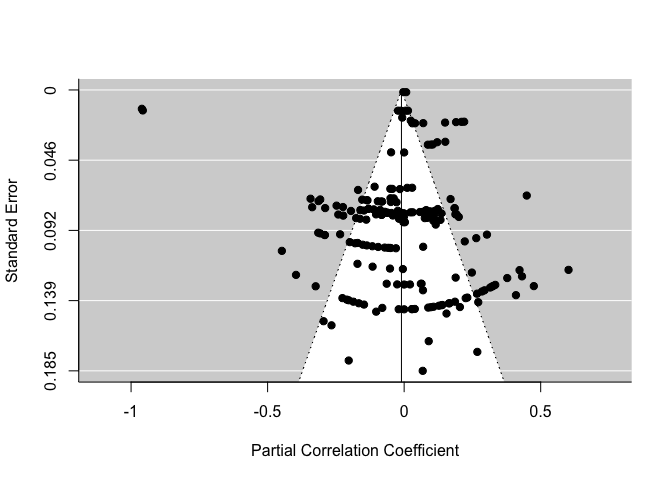
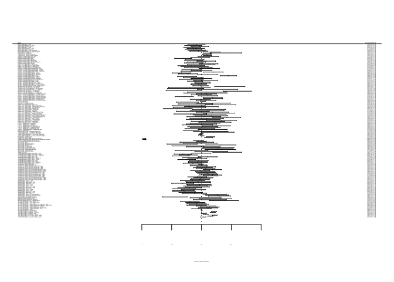

First Analysis 4-30
================
Alicia
4/30/2021

## Step 1: Import & clean data

<details>

<summary> Click to expand and see the initial data import and cleaning
steps & full table from the data extraction form. </summary>

``` r
library(tidyverse)
library(metafor)
library(clubSandwich)
library(robumeta)
library(kableExtra)
library(table1)
```

**Import data, making sure everything is the correct data type.**

``` r
all_data = read_csv("Data/FirstPassData4-30.csv",
                      # up to outcome + up to exposure_reliability + 
                      col_types = paste0("nnccccfffccffcfffcncccc", "ffffffffffffffllcllllclfc", "fccccfnnnnllnnncnnnlflcc"))
```

**Fill in information in columns that are aggregates of others.**

``` r
all_data = all_data %>% 
  group_by(Study_ID) %>% 
  mutate(Combined_survey_surveillance = paste0(unique(Survey_surveillance), collapse = " & "),
         Combined_outcome_data_source = paste0(unique(Outcome_data_source), collapse = " & "),
         Combined_exposure_level = paste0(unique(Exposure_level), collapse = " & "),
         Combined_outcome_type_factor = paste0(unique(Outcome_type_factor), collapse = " & "),
         Num_EMs_from_this_study = length(unique(Effect_ID))
  ) %>% 
  ungroup() %>% 
  mutate(Exposure_category_economic = Exposure_category_employment | Exposure_category_financial,
         Exposure_combo = (as.integer(!is.na(Exposure_labor_force_participation)) +
                             as.integer(!is.na(Exposure_employment_unemployment)) +
                             as.integer(!is.na(Exposure_income)) +
                             as.integer(!is.na(Exposure_management_professional_roles))+
                             as.integer(!is.na(Exposure_women_owned_businesses)) +
                             as.integer(!is.na(Exposure_education)) +
                             as.integer(!is.na(Exposure_poverty)) +
                             as.integer(!is.na(Exposure_representation_in_government)) +
                             as.integer(!is.na(Exposure_voter_registration_civic_participation)) +
                             as.integer(!is.na(Exposure_maternal_mortality)) +
                             as.integer(!is.na(Exposure_teen_pregnancy)) +
                             as.integer(!is.na(Exposure_other_health_outcomes)) +
                             as.integer(!is.na(Exposure_women_legal_rights))) > 1,
         Unadjusted = Confounders == "NONE (UNADJUSTED)"
  ) %>% 
  group_by(Study_ID) %>% 
  mutate(Combined_exposure_types = paste0(c(rep("Economic", min(sum(Exposure_category_economic, na.rm = TRUE), 1)),
                                            rep("Education", min(sum(Exposure_category_education, na.rm = TRUE), 1)),
                                            rep("Political representation", min(sum(Exposure_category_political, na.rm = TRUE), 1)), 
                                            rep("Legal rights", min(sum(Exposure_category_legal_rights, na.rm = TRUE), 1)),
                                            rep("Health indicators", min(sum(Exposure_category_womens_health, na.rm = TRUE), 1))
                                            ), collapse = " & ")
  ) %>% 
  ungroup() %>% 
  mutate_if(is.logical, ~replace(., is.na(.), FALSE))
```

</details>

*TODOs & options moving forward:*

  - Double-check the accuracy of the `Outcome` & `Outcome_type_factor`
    columns (esp. info about victim sex)
  - Are the `Outcome` categories what make the most sense for analysis?
  - Are the `Exposure` categories what make the most senese for
    analysis?
  - Do we want to do anything quantitative with `Confounders`?
  - Anything else that would make sense as a predictor that we haven’t
    captured?
      - Maybe: location (South / not South? Within 1 state vs. aross
        many?)
      - Maybe: race

## Step 2: Describe the data

**Summary stats, study-level:**

``` r
study_level = all_data %>% 
  distinct(Study_ID, .keep_all = TRUE)

# table1(~ as.numeric(PubYear) + 
#        Combined_outcome_data_source + Combined_outcome_type_factor +
#        Combined_exposure_level + Combined_exposure_types + Exposure_combo +
#        Unadjusted + Model_type + Num_EMs_from_this_study, data = study_level)
```

**Summary stats, EM-level:**

``` r
em_level = all_data %>% 
  mutate(Included_in_meta_regression = ifelse(Include_in_regression %in% c("Yes", "Maybe - can we treat SUR like normal?", "Maybe - no variance with partial correlation") & Study_ID != 30,
                                              "Yes", "No"))

table1(~ as.numeric(PubYear) + Decade + Survey_surveillance + Study_design + Ecological_cross_level +
         Outcome_data_source_condensed + Outcome_type_factor +
       Exposure_level + Exposure_combo + Exposure_category_employment + Exposure_category_education + 
         Exposure_category_political + Exposure_category_legal_rights + Exposure_category_womens_health +
         Exposure_absolute_or_relative +
       Sample_size + Unadjusted + Model_type | Included_in_meta_regression, data = em_level)
```

    ## [1] "<table class=\"Rtable1\">\n<thead>\n<tr>\n<th class='rowlabel firstrow lastrow'></th>\n<th class='firstrow lastrow'><span class='stratlabel'>No<br><span class='stratn'>(N=45)</span></span></th>\n<th class='firstrow lastrow'><span class='stratlabel'>Yes<br><span class='stratn'>(N=190)</span></span></th>\n<th class='firstrow lastrow'><span class='stratlabel'>Overall<br><span class='stratn'>(N=235)</span></span></th>\n</tr>\n</thead>\n<tbody>\n<tr>\n<td class='rowlabel firstrow'><span class='varlabel'>as.numeric(PubYear)</span></td>\n<td class='firstrow'></td>\n<td class='firstrow'></td>\n<td class='firstrow'></td>\n</tr>\n<tr>\n<td class='rowlabel'>Mean (SD)</td>\n<td>2000 (12.1)</td>\n<td>2010 (9.44)</td>\n<td>2000 (10.8)</td>\n</tr>\n<tr>\n<td class='rowlabel lastrow'>Median [Min, Max]</td>\n<td class='lastrow'>2000 [1980, 2020]</td>\n<td class='lastrow'>2010 [1980, 2020]</td>\n<td class='lastrow'>2000 [1980, 2020]</td>\n</tr>\n<tr>\n<td class='rowlabel firstrow'><span class='varlabel'>Decade</span></td>\n<td class='firstrow'></td>\n<td class='firstrow'></td>\n<td class='firstrow'></td>\n</tr>\n<tr>\n<td class='rowlabel'>1990s</td>\n<td>11 (24.4%)</td>\n<td>70 (36.8%)</td>\n<td>81 (34.5%)</td>\n</tr>\n<tr>\n<td class='rowlabel'>1980s</td>\n<td>15 (33.3%)</td>\n<td>41 (21.6%)</td>\n<td>56 (23.8%)</td>\n</tr>\n<tr>\n<td class='rowlabel'>2010s</td>\n<td>2 (4.4%)</td>\n<td>39 (20.5%)</td>\n<td>41 (17.4%)</td>\n</tr>\n<tr>\n<td class='rowlabel'>2000s</td>\n<td>2 (4.4%)</td>\n<td>28 (14.7%)</td>\n<td>30 (12.8%)</td>\n</tr>\n<tr>\n<td class='rowlabel lastrow'>1970s</td>\n<td class='lastrow'>15 (33.3%)</td>\n<td class='lastrow'>12 (6.3%)</td>\n<td class='lastrow'>27 (11.5%)</td>\n</tr>\n<tr>\n<td class='rowlabel firstrow'><span class='varlabel'>Survey_surveillance</span></td>\n<td class='firstrow'></td>\n<td class='firstrow'></td>\n<td class='firstrow'></td>\n</tr>\n<tr>\n<td class='rowlabel'>Surveillance</td>\n<td>29 (64.4%)</td>\n<td>131 (68.9%)</td>\n<td>160 (68.1%)</td>\n</tr>\n<tr>\n<td class='rowlabel lastrow'>Survey</td>\n<td class='lastrow'>16 (35.6%)</td>\n<td class='lastrow'>59 (31.1%)</td>\n<td class='lastrow'>75 (31.9%)</td>\n</tr>\n<tr>\n<td class='rowlabel firstrow'><span class='varlabel'>Study_design</span></td>\n<td class='firstrow'></td>\n<td class='firstrow'></td>\n<td class='firstrow'></td>\n</tr>\n<tr>\n<td class='rowlabel'>Serial cross-sectional</td>\n<td>8 (17.8%)</td>\n<td>18 (9.5%)</td>\n<td>26 (11.1%)</td>\n</tr>\n<tr>\n<td class='rowlabel'>Cross-sectional</td>\n<td>35 (77.8%)</td>\n<td>166 (87.4%)</td>\n<td>201 (85.5%)</td>\n</tr>\n<tr>\n<td class='rowlabel'>Difference over time in exposure vs. outcome</td>\n<td>0 (0%)</td>\n<td>3 (1.6%)</td>\n<td>3 (1.3%)</td>\n</tr>\n<tr>\n<td class='rowlabel lastrow'>Longitudinal</td>\n<td class='lastrow'>2 (4.4%)</td>\n<td class='lastrow'>3 (1.6%)</td>\n<td class='lastrow'>5 (2.1%)</td>\n</tr>\n<tr>\n<td class='rowlabel firstrow'><span class='varlabel'>Ecological_cross_level</span></td>\n<td class='firstrow'></td>\n<td class='firstrow'></td>\n<td class='firstrow'></td>\n</tr>\n<tr>\n<td class='rowlabel'>Ecological</td>\n<td>41 (91.1%)</td>\n<td>181 (95.3%)</td>\n<td>222 (94.5%)</td>\n</tr>\n<tr>\n<td class='rowlabel'>Unable to determine</td>\n<td>1 (2.2%)</td>\n<td>0 (0%)</td>\n<td>1 (0.4%)</td>\n</tr>\n<tr>\n<td class='rowlabel lastrow'>Cross-level</td>\n<td class='lastrow'>3 (6.7%)</td>\n<td class='lastrow'>9 (4.7%)</td>\n<td class='lastrow'>12 (5.1%)</td>\n</tr>\n<tr>\n<td class='rowlabel firstrow'><span class='varlabel'>Outcome_data_source_condensed</span></td>\n<td class='firstrow'></td>\n<td class='firstrow'></td>\n<td class='firstrow'></td>\n</tr>\n<tr>\n<td class='rowlabel'>Hospital records</td>\n<td>1 (2.2%)</td>\n<td>0 (0%)</td>\n<td>1 (0.4%)</td>\n</tr>\n<tr>\n<td class='rowlabel'>FBI</td>\n<td>33 (73.3%)</td>\n<td>118 (62.1%)</td>\n<td>151 (64.3%)</td>\n</tr>\n<tr>\n<td class='rowlabel'>Other (DOE)</td>\n<td>1 (2.2%)</td>\n<td>0 (0%)</td>\n<td>1 (0.4%)</td>\n</tr>\n<tr>\n<td class='rowlabel'>CDC</td>\n<td>0 (0%)</td>\n<td>6 (3.2%)</td>\n<td>6 (2.6%)</td>\n</tr>\n<tr>\n<td class='rowlabel'>Survey</td>\n<td>6 (13.3%)</td>\n<td>59 (31.1%)</td>\n<td>65 (27.7%)</td>\n</tr>\n<tr>\n<td class='rowlabel lastrow'>Local law enforcement</td>\n<td class='lastrow'>4 (8.9%)</td>\n<td class='lastrow'>7 (3.7%)</td>\n<td class='lastrow'>11 (4.7%)</td>\n</tr>\n<tr>\n<td class='rowlabel firstrow'><span class='varlabel'>Outcome_type_factor</span></td>\n<td class='firstrow'></td>\n<td class='firstrow'></td>\n<td class='firstrow'></td>\n</tr>\n<tr>\n<td class='rowlabel'>Assault</td>\n<td>5 (11.1%)</td>\n<td>9 (4.7%)</td>\n<td>14 (6.0%)</td>\n</tr>\n<tr>\n<td class='rowlabel'>Intimate partner homicide</td>\n<td>4 (8.9%)</td>\n<td>25 (13.2%)</td>\n<td>29 (12.3%)</td>\n</tr>\n<tr>\n<td class='rowlabel'>Rape</td>\n<td>23 (51.1%)</td>\n<td>67 (35.3%)</td>\n<td>90 (38.3%)</td>\n</tr>\n<tr>\n<td class='rowlabel'>Female homicide</td>\n<td>9 (20.0%)</td>\n<td>47 (24.7%)</td>\n<td>56 (23.8%)</td>\n</tr>\n<tr>\n<td class='rowlabel'>IPV</td>\n<td>4 (8.9%)</td>\n<td>25 (13.2%)</td>\n<td>29 (12.3%)</td>\n</tr>\n<tr>\n<td class='rowlabel'>Family violence</td>\n<td>0 (0%)</td>\n<td>3 (1.6%)</td>\n<td>3 (1.3%)</td>\n</tr>\n<tr>\n<td class='rowlabel'>Sexual assault</td>\n<td>0 (0%)</td>\n<td>8 (4.2%)</td>\n<td>8 (3.4%)</td>\n</tr>\n<tr>\n<td class='rowlabel lastrow'>Harassment</td>\n<td class='lastrow'>0 (0%)</td>\n<td class='lastrow'>6 (3.2%)</td>\n<td class='lastrow'>6 (2.6%)</td>\n</tr>\n<tr>\n<td class='rowlabel firstrow'><span class='varlabel'>Exposure_level</span></td>\n<td class='firstrow'></td>\n<td class='firstrow'></td>\n<td class='firstrow'></td>\n</tr>\n<tr>\n<td class='rowlabel'>County</td>\n<td>7 (15.6%)</td>\n<td>10 (5.3%)</td>\n<td>17 (7.2%)</td>\n</tr>\n<tr>\n<td class='rowlabel'>State</td>\n<td>3 (6.7%)</td>\n<td>64 (33.7%)</td>\n<td>67 (28.5%)</td>\n</tr>\n<tr>\n<td class='rowlabel'>City</td>\n<td>33 (73.3%)</td>\n<td>91 (47.9%)</td>\n<td>124 (52.8%)</td>\n</tr>\n<tr>\n<td class='rowlabel'>MSA</td>\n<td>1 (2.2%)</td>\n<td>20 (10.5%)</td>\n<td>21 (8.9%)</td>\n</tr>\n<tr>\n<td class='rowlabel'>Neighborhood</td>\n<td>1 (2.2%)</td>\n<td>3 (1.6%)</td>\n<td>4 (1.7%)</td>\n</tr>\n<tr>\n<td class='rowlabel lastrow'>Occupation & Industry</td>\n<td class='lastrow'>0 (0%)</td>\n<td class='lastrow'>2 (1.1%)</td>\n<td class='lastrow'>2 (0.9%)</td>\n</tr>\n<tr>\n<td class='rowlabel firstrow'><span class='varlabel'>Exposure_combo</span></td>\n<td class='firstrow'></td>\n<td class='firstrow'></td>\n<td class='firstrow'></td>\n</tr>\n<tr>\n<td class='rowlabel'>Yes</td>\n<td>6 (13.3%)</td>\n<td>47 (24.7%)</td>\n<td>53 (22.6%)</td>\n</tr>\n<tr>\n<td class='rowlabel lastrow'>No</td>\n<td class='lastrow'>39 (86.7%)</td>\n<td class='lastrow'>143 (75.3%)</td>\n<td class='lastrow'>182 (77.4%)</td>\n</tr>\n<tr>\n<td class='rowlabel firstrow'><span class='varlabel'>Exposure_category_employment</span></td>\n<td class='firstrow'></td>\n<td class='firstrow'></td>\n<td class='firstrow'></td>\n</tr>\n<tr>\n<td class='rowlabel'>Yes</td>\n<td>21 (46.7%)</td>\n<td>105 (55.3%)</td>\n<td>126 (53.6%)</td>\n</tr>\n<tr>\n<td class='rowlabel lastrow'>No</td>\n<td class='lastrow'>24 (53.3%)</td>\n<td class='lastrow'>85 (44.7%)</td>\n<td class='lastrow'>109 (46.4%)</td>\n</tr>\n<tr>\n<td class='rowlabel firstrow'><span class='varlabel'>Exposure_category_education</span></td>\n<td class='firstrow'></td>\n<td class='firstrow'></td>\n<td class='firstrow'></td>\n</tr>\n<tr>\n<td class='rowlabel'>Yes</td>\n<td>12 (26.7%)</td>\n<td>69 (36.3%)</td>\n<td>81 (34.5%)</td>\n</tr>\n<tr>\n<td class='rowlabel lastrow'>No</td>\n<td class='lastrow'>33 (73.3%)</td>\n<td class='lastrow'>121 (63.7%)</td>\n<td class='lastrow'>154 (65.5%)</td>\n</tr>\n<tr>\n<td class='rowlabel firstrow'><span class='varlabel'>Exposure_category_political</span></td>\n<td class='firstrow'></td>\n<td class='firstrow'></td>\n<td class='firstrow'></td>\n</tr>\n<tr>\n<td class='rowlabel'>Yes</td>\n<td>2 (4.4%)</td>\n<td>32 (16.8%)</td>\n<td>34 (14.5%)</td>\n</tr>\n<tr>\n<td class='rowlabel lastrow'>No</td>\n<td class='lastrow'>43 (95.6%)</td>\n<td class='lastrow'>158 (83.2%)</td>\n<td class='lastrow'>201 (85.5%)</td>\n</tr>\n<tr>\n<td class='rowlabel firstrow'><span class='varlabel'>Exposure_category_legal_rights</span></td>\n<td class='firstrow'></td>\n<td class='firstrow'></td>\n<td class='firstrow'></td>\n</tr>\n<tr>\n<td class='rowlabel'>Yes</td>\n<td>0 (0%)</td>\n<td>3 (1.6%)</td>\n<td>3 (1.3%)</td>\n</tr>\n<tr>\n<td class='rowlabel lastrow'>No</td>\n<td class='lastrow'>45 (100%)</td>\n<td class='lastrow'>187 (98.4%)</td>\n<td class='lastrow'>232 (98.7%)</td>\n</tr>\n<tr>\n<td class='rowlabel firstrow'><span class='varlabel'>Exposure_category_womens_health</span></td>\n<td class='firstrow'></td>\n<td class='firstrow'></td>\n<td class='firstrow'></td>\n</tr>\n<tr>\n<td class='rowlabel'>Yes</td>\n<td>0 (0%)</td>\n<td>14 (7.4%)</td>\n<td>14 (6.0%)</td>\n</tr>\n<tr>\n<td class='rowlabel lastrow'>No</td>\n<td class='lastrow'>45 (100%)</td>\n<td class='lastrow'>176 (92.6%)</td>\n<td class='lastrow'>221 (94.0%)</td>\n</tr>\n<tr>\n<td class='rowlabel firstrow'><span class='varlabel'>Exposure_absolute_or_relative</span></td>\n<td class='firstrow'></td>\n<td class='firstrow'></td>\n<td class='firstrow'></td>\n</tr>\n<tr>\n<td class='rowlabel'>Relative</td>\n<td>18 (40.0%)</td>\n<td>159 (83.7%)</td>\n<td>177 (75.3%)</td>\n</tr>\n<tr>\n<td class='rowlabel'>Both/mix</td>\n<td>3 (6.7%)</td>\n<td>21 (11.1%)</td>\n<td>24 (10.2%)</td>\n</tr>\n<tr>\n<td class='rowlabel lastrow'>Relative - Difference</td>\n<td class='lastrow'>24 (53.3%)</td>\n<td class='lastrow'>10 (5.3%)</td>\n<td class='lastrow'>34 (14.5%)</td>\n</tr>\n<tr>\n<td class='rowlabel firstrow'><span class='varlabel'>Sample_size</span></td>\n<td class='firstrow'></td>\n<td class='firstrow'></td>\n<td class='firstrow'></td>\n</tr>\n<tr>\n<td class='rowlabel'>Mean (SD)</td>\n<td>129000 (604000)</td>\n<td>5480 (49800)</td>\n<td>29100 (270000)</td>\n</tr>\n<tr>\n<td class='rowlabel lastrow'>Median [Min, Max]</td>\n<td class='lastrow'>172 [25.0, 2900000]</td>\n<td class='lastrow'>148 [31.0, 487000]</td>\n<td class='lastrow'>148 [25.0, 2900000]</td>\n</tr>\n<tr>\n<td class='rowlabel firstrow'><span class='varlabel'>Unadjusted</span></td>\n<td class='firstrow'></td>\n<td class='firstrow'></td>\n<td class='firstrow'></td>\n</tr>\n<tr>\n<td class='rowlabel'>Yes</td>\n<td>0 (0%)</td>\n<td>43 (22.6%)</td>\n<td>43 (18.3%)</td>\n</tr>\n<tr>\n<td class='rowlabel lastrow'>No</td>\n<td class='lastrow'>45 (100%)</td>\n<td class='lastrow'>147 (77.4%)</td>\n<td class='lastrow'>192 (81.7%)</td>\n</tr>\n<tr>\n<td class='rowlabel firstrow'><span class='varlabel'>Model_type</span></td>\n<td class='firstrow'></td>\n<td class='firstrow'></td>\n<td class='firstrow'></td>\n</tr>\n<tr>\n<td class='rowlabel'>UNSURE</td>\n<td>1 (2.2%)</td>\n<td>0 (0%)</td>\n<td>1 (0.4%)</td>\n</tr>\n<tr>\n<td class='rowlabel'>Multilevel (UNSURE)</td>\n<td>1 (2.2%)</td>\n<td>0 (0%)</td>\n<td>1 (0.4%)</td>\n</tr>\n<tr>\n<td class='rowlabel'>Linear regression</td>\n<td>20 (44.4%)</td>\n<td>82 (43.2%)</td>\n<td>102 (43.4%)</td>\n</tr>\n<tr>\n<td class='rowlabel'>Negative binomial Poisson regression</td>\n<td>4 (8.9%)</td>\n<td>34 (17.9%)</td>\n<td>38 (16.2%)</td>\n</tr>\n<tr>\n<td class='rowlabel'>Seemingly Unrelated Regression</td>\n<td>0 (0%)</td>\n<td>8 (4.2%)</td>\n<td>8 (3.4%)</td>\n</tr>\n<tr>\n<td class='rowlabel'>Tobit regression</td>\n<td>0 (0%)</td>\n<td>4 (2.1%)</td>\n<td>4 (1.7%)</td>\n</tr>\n<tr>\n<td class='rowlabel'>Partial regression (\"lowest 2nd order partial correlation\")</td>\n<td>14 (31.1%)</td>\n<td>0 (0%)</td>\n<td>14 (6.0%)</td>\n</tr>\n<tr>\n<td class='rowlabel'>Poisson regression</td>\n<td>0 (0%)</td>\n<td>15 (7.9%)</td>\n<td>15 (6.4%)</td>\n</tr>\n<tr>\n<td class='rowlabel'>Pearson correlation</td>\n<td>0 (0%)</td>\n<td>27 (14.2%)</td>\n<td>27 (11.5%)</td>\n</tr>\n<tr>\n<td class='rowlabel'>Multilevel logistic regression</td>\n<td>0 (0%)</td>\n<td>1 (0.5%)</td>\n<td>1 (0.4%)</td>\n</tr>\n<tr>\n<td class='rowlabel'>Logistic regression</td>\n<td>1 (2.2%)</td>\n<td>6 (3.2%)</td>\n<td>7 (3.0%)</td>\n</tr>\n<tr>\n<td class='rowlabel'>Multivariable structural equation model (SEM) with MLE and robust SEs</td>\n<td>0 (0%)</td>\n<td>2 (1.1%)</td>\n<td>2 (0.9%)</td>\n</tr>\n<tr>\n<td class='rowlabel'>Log-transformed outcome [IS THIS POISSON?]</td>\n<td>3 (6.7%)</td>\n<td>9 (4.7%)</td>\n<td>12 (5.1%)</td>\n</tr>\n<tr>\n<td class='rowlabel'>Heirarchical logistic regression</td>\n<td>0 (0%)</td>\n<td>2 (1.1%)</td>\n<td>2 (0.9%)</td>\n</tr>\n<tr>\n<td class='rowlabel lastrow'>NONE</td>\n<td class='lastrow'>1 (2.2%)</td>\n<td class='lastrow'>0 (0%)</td>\n<td class='lastrow'>1 (0.4%)</td>\n</tr>\n</tbody>\n</table>\n"

<details>

<summary> Click to see Table listing all studies </summary>

``` r
for_summary = study_level %>% 
  select(Authors_abbr,
         PubYear,
         Title,
         Hypothesis,
         Combined_survey_surveillance,
         Source_population,
         Combined_outcome_data_source,
         Combined_exposure_level,
         Combined_exposure_types,
         Combined_outcome_type_factor,
         # NOTE: this isn't necessarily consistent per study
         Sample_size,
         Num_EMs_from_this_study)

kable_paper(
  kable(for_summary,
        caption = "Descriptive Information of Included Studies"),
        bootstrap_options = "condensed"
)
```

<table class=" lightable-paper" style='font-family: "Arial Narrow", arial, helvetica, sans-serif; margin-left: auto; margin-right: auto;'>

<caption>

Descriptive Information of Included Studies

</caption>

<thead>

<tr>

<th style="text-align:left;">

Authors\_abbr

</th>

<th style="text-align:left;">

PubYear

</th>

<th style="text-align:left;">

Title

</th>

<th style="text-align:left;">

Hypothesis

</th>

<th style="text-align:left;">

Combined\_survey\_surveillance

</th>

<th style="text-align:left;">

Source\_population

</th>

<th style="text-align:left;">

Combined\_outcome\_data\_source

</th>

<th style="text-align:left;">

Combined\_exposure\_level

</th>

<th style="text-align:left;">

Combined\_exposure\_types

</th>

<th style="text-align:left;">

Combined\_outcome\_type\_factor

</th>

<th style="text-align:right;">

Sample\_size

</th>

<th style="text-align:right;">

Num\_EMs\_from\_this\_study

</th>

</tr>

</thead>

<tbody>

<tr>

<td style="text-align:left;">

Aizer

</td>

<td style="text-align:left;">

2010

</td>

<td style="text-align:left;">

The gender wage gap and domestic violence

</td>

<td style="text-align:left;">

Amelioration

</td>

<td style="text-align:left;">

Surveillance

</td>

<td style="text-align:left;">

California counties

</td>

<td style="text-align:left;">

Hospital records

</td>

<td style="text-align:left;">

County

</td>

<td style="text-align:left;">

Economic

</td>

<td style="text-align:left;">

Assault

</td>

<td style="text-align:right;">

982

</td>

<td style="text-align:right;">

1

</td>

</tr>

<tr>

<td style="text-align:left;">

Avakame

</td>

<td style="text-align:left;">

1998

</td>

<td style="text-align:left;">

How different is violence in the home? An examination of some correlates
of stranger and intimate homicide

</td>

<td style="text-align:left;">

None

</td>

<td style="text-align:left;">

Surveillance

</td>

<td style="text-align:left;">

All U.S. (surveillance)

</td>

<td style="text-align:left;">

FBI

</td>

<td style="text-align:left;">

State

</td>

<td style="text-align:left;">

Economic & Political representation

</td>

<td style="text-align:left;">

Intimate partner homicide

</td>

<td style="text-align:right;">

50

</td>

<td style="text-align:right;">

1

</td>

</tr>

<tr>

<td style="text-align:left;">

Bailey

</td>

<td style="text-align:left;">

1999

</td>

<td style="text-align:left;">

The socioeconomic status of women and patterns of forcible rape for
major U.S. cities

</td>

<td style="text-align:left;">

Amelioration

</td>

<td style="text-align:left;">

Surveillance

</td>

<td style="text-align:left;">

Cities (population \> 100,000)

</td>

<td style="text-align:left;">

FBI

</td>

<td style="text-align:left;">

City

</td>

<td style="text-align:left;">

Economic & Education

</td>

<td style="text-align:left;">

Rape

</td>

<td style="text-align:right;">

192

</td>

<td style="text-align:right;">

9

</td>

</tr>

<tr>

<td style="text-align:left;">

Baron & Straus

</td>

<td style="text-align:left;">

1989

</td>

<td style="text-align:left;">

Rape and its relation to social disorganization, pornography and
inequality in the USA

</td>

<td style="text-align:left;">

Considers multiple

</td>

<td style="text-align:left;">

Surveillance

</td>

<td style="text-align:left;">

All U.S. (surveillance)

</td>

<td style="text-align:left;">

FBI

</td>

<td style="text-align:left;">

State

</td>

<td style="text-align:left;">

Economic & Political representation & Health indicators

</td>

<td style="text-align:left;">

Rape

</td>

<td style="text-align:right;">

50

</td>

<td style="text-align:right;">

1

</td>

</tr>

<tr>

<td style="text-align:left;">

Boyle et al.

</td>

<td style="text-align:left;">

2017

</td>

<td style="text-align:left;">

The effects of feminist mobilization and women’s status on universities’
reporting of rape

</td>

<td style="text-align:left;">

Other - feminist mobilization on college campuses increases rape
reporting

</td>

<td style="text-align:left;">

Surveillance

</td>

<td style="text-align:left;">

Students at 413 “top” colleges in 47 states

</td>

<td style="text-align:left;">

DOE reports from universities

</td>

<td style="text-align:left;">

State

</td>

<td style="text-align:left;">

Economic

</td>

<td style="text-align:left;">

Rape

</td>

<td style="text-align:right;">

1644

</td>

<td style="text-align:right;">

1

</td>

</tr>

<tr>

<td style="text-align:left;">

Brewer & Smith

</td>

<td style="text-align:left;">

1995

</td>

<td style="text-align:left;">

Gender inequality and rates of female homicide victimization across U.S.
cities

</td>

<td style="text-align:left;">

None

</td>

<td style="text-align:left;">

Surveillance

</td>

<td style="text-align:left;">

Cities (population \> 250,000)

</td>

<td style="text-align:left;">

FBI

</td>

<td style="text-align:left;">

City

</td>

<td style="text-align:left;">

Economic & Education

</td>

<td style="text-align:left;">

Female homicide

</td>

<td style="text-align:right;">

177

</td>

<td style="text-align:right;">

6

</td>

</tr>

<tr>

<td style="text-align:left;">

Campbell et al.

</td>

<td style="text-align:left;">

2019

</td>

<td style="text-align:left;">

The relative risk of intimate partner and other homicide victimization
by state-level gender inequity in the United States, 2000–2017

</td>

<td style="text-align:left;">

Amelioration

</td>

<td style="text-align:left;">

Surveillance

</td>

<td style="text-align:left;">

All U.S. (surveillance)

</td>

<td style="text-align:left;">

FBI & CDC

</td>

<td style="text-align:left;">

State

</td>

<td style="text-align:left;">

Economic & Political representation & Health indicators

</td>

<td style="text-align:left;">

Intimate partner homicide & Female homicide

</td>

<td style="text-align:right;">

792

</td>

<td style="text-align:right;">

3

</td>

</tr>

<tr>

<td style="text-align:left;">

D’Alessio & Stolzenberg

</td>

<td style="text-align:left;">

2010

</td>

<td style="text-align:left;">

The sex ratio and male-on-female intimate partner violence

</td>

<td style="text-align:left;">

Other - sex ratio

</td>

<td style="text-align:left;">

Surveillance

</td>

<td style="text-align:left;">

Cities (population \> 50,000)

</td>

<td style="text-align:left;">

FBI

</td>

<td style="text-align:left;">

City

</td>

<td style="text-align:left;">

Economic

</td>

<td style="text-align:left;">

IPV

</td>

<td style="text-align:right;">

134

</td>

<td style="text-align:right;">

1

</td>

</tr>

<tr>

<td style="text-align:left;">

DeWees & Parker

</td>

<td style="text-align:left;">

2003

</td>

<td style="text-align:left;">

The political economy of urban homicide: assessing the relative impact
of gender inequality on sex-specific victimization

</td>

<td style="text-align:left;">

Considers multiple

</td>

<td style="text-align:left;">

Surveillance

</td>

<td style="text-align:left;">

Cities (population \> 100,000)

</td>

<td style="text-align:left;">

FBI

</td>

<td style="text-align:left;">

City

</td>

<td style="text-align:left;">

Economic & Education & Political representation

</td>

<td style="text-align:left;">

Female homicide

</td>

<td style="text-align:right;">

165

</td>

<td style="text-align:right;">

8

</td>

</tr>

<tr>

<td style="text-align:left;">

Dugan et al.

</td>

<td style="text-align:left;">

1999

</td>

<td style="text-align:left;">

Explaining the decline in intimate partner homicide: the effects of
changing domesticity, women’s status, and domestic violence resources

</td>

<td style="text-align:left;">

Amelioration

</td>

<td style="text-align:left;">

Surveillance

</td>

<td style="text-align:left;">

Cities (in the 25 largest MSAs)

</td>

<td style="text-align:left;">

FBI

</td>

<td style="text-align:left;">

City

</td>

<td style="text-align:left;">

Economic & Education

</td>

<td style="text-align:left;">

Intimate partner homicide

</td>

<td style="text-align:right;">

116

</td>

<td style="text-align:right;">

4

</td>

</tr>

<tr>

<td style="text-align:left;">

Ellis & Beattie

</td>

<td style="text-align:left;">

1983

</td>

<td style="text-align:left;">

The feminist explanation for rape: an empirical test

</td>

<td style="text-align:left;">

Amelioration

</td>

<td style="text-align:left;">

Survey

</td>

<td style="text-align:left;">

Large cities

</td>

<td style="text-align:left;">

FBI & Survey (NCVS)

</td>

<td style="text-align:left;">

City

</td>

<td style="text-align:left;">

Economic & Education

</td>

<td style="text-align:left;">

Rape

</td>

<td style="text-align:right;">

25

</td>

<td style="text-align:right;">

14

</td>

</tr>

<tr>

<td style="text-align:left;">

Eschholz & Vieraitis

</td>

<td style="text-align:left;">

2004

</td>

<td style="text-align:left;">

Race-specific gender equality and rape: a further test of feminist
hypotheses

</td>

<td style="text-align:left;">

Other - race will modify relationship

</td>

<td style="text-align:left;">

Surveillance

</td>

<td style="text-align:left;">

Cities (population \> 100,000 & Black residents \> 2,000)

</td>

<td style="text-align:left;">

FBI

</td>

<td style="text-align:left;">

City

</td>

<td style="text-align:left;">

Economic & Education

</td>

<td style="text-align:left;">

Rape

</td>

<td style="text-align:right;">

148

</td>

<td style="text-align:right;">

12

</td>

</tr>

<tr>

<td style="text-align:left;">

Gillespie & Reckdenwald

</td>

<td style="text-align:left;">

2015

</td>

<td style="text-align:left;">

Gender equality, place, and female-victim intimate partner homicide: a
county-level analysis in North Carolina

</td>

<td style="text-align:left;">

Backlash

</td>

<td style="text-align:left;">

Surveillance

</td>

<td style="text-align:left;">

North Carolina counties

</td>

<td style="text-align:left;">

Compilation of law enforcement records & media reports (North Carolina
Coalition Against Domestic Violence)

</td>

<td style="text-align:left;">

County

</td>

<td style="text-align:left;">

Economic & Education

</td>

<td style="text-align:left;">

Intimate partner homicide

</td>

<td style="text-align:right;">

100

</td>

<td style="text-align:right;">

2

</td>

</tr>

<tr>

<td style="text-align:left;">

Goodson & Bouffard

</td>

<td style="text-align:left;">

2019

</td>

<td style="text-align:left;">

Social disorganization and gender equality as correlates of family
violence and rape

</td>

<td style="text-align:left;">

Other - interested in social disorganization

</td>

<td style="text-align:left;">

Surveillance

</td>

<td style="text-align:left;">

Texas counties

</td>

<td style="text-align:left;">

FBI & Local law enforcement

</td>

<td style="text-align:left;">

County

</td>

<td style="text-align:left;">

Economic & Education

</td>

<td style="text-align:left;">

Rape & Family violence

</td>

<td style="text-align:right;">

254

</td>

<td style="text-align:right;">

6

</td>

</tr>

<tr>

<td style="text-align:left;">

Gressard et al.

</td>

<td style="text-align:left;">

2015

</td>

<td style="text-align:left;">

A first look at gender inequality as a societal risk factor for dating
violence

</td>

<td style="text-align:left;">

Amelioration

</td>

<td style="text-align:left;">

Survey

</td>

<td style="text-align:left;">

Adolescents - All U.S. (nationally representative survey)

</td>

<td style="text-align:left;">

Survey (YRBS)

</td>

<td style="text-align:left;">

State

</td>

<td style="text-align:left;">

Economic & Education & Political representation & Health indicators

</td>

<td style="text-align:left;">

IPV

</td>

<td style="text-align:right;">

38

</td>

<td style="text-align:right;">

8

</td>

</tr>

<tr>

<td style="text-align:left;">

Haynie & Armstrong

</td>

<td style="text-align:left;">

2006

</td>

<td style="text-align:left;">

Race and gender-disaggregated homicide offending rates: differences and
similarities by victim-offender relations across cities

</td>

<td style="text-align:left;">

Amelioration

</td>

<td style="text-align:left;">

Surveillance

</td>

<td style="text-align:left;">

Cities (population \> 100,000 & Black residents \> 5,000)

</td>

<td style="text-align:left;">

FBI

</td>

<td style="text-align:left;">

City & MSA

</td>

<td style="text-align:left;">

Economic

</td>

<td style="text-align:left;">

Intimate partner homicide & Female homicide

</td>

<td style="text-align:right;">

148

</td>

<td style="text-align:right;">

8

</td>

</tr>

<tr>

<td style="text-align:left;">

Henke & Lin-chi

</td>

<td style="text-align:left;">

2020

</td>

<td style="text-align:left;">

The gender wage gap, weather, and intimate partner violence

</td>

<td style="text-align:left;">

Amelioration

</td>

<td style="text-align:left;">

Surveillance

</td>

<td style="text-align:left;">

All U.S. (surveillance)

</td>

<td style="text-align:left;">

FBI

</td>

<td style="text-align:left;">

County

</td>

<td style="text-align:left;">

Economic

</td>

<td style="text-align:left;">

IPV

</td>

<td style="text-align:right;">

2898939

</td>

<td style="text-align:right;">

2

</td>

</tr>

<tr>

<td style="text-align:left;">

Jackson

</td>

<td style="text-align:left;">

2016

</td>

<td style="text-align:left;">

The combined effect of women’s neighborhood resources and collective
efficacy on IPV

</td>

<td style="text-align:left;">

Amelioration

</td>

<td style="text-align:left;">

Survey

</td>

<td style="text-align:left;">

Chicago neighborhoods (female primary caregivers of children, married or
cohabitating)

</td>

<td style="text-align:left;">

Survey

</td>

<td style="text-align:left;">

Neighborhood

</td>

<td style="text-align:left;">

Economic & Education

</td>

<td style="text-align:left;">

IPV

</td>

<td style="text-align:right;">

2463

</td>

<td style="text-align:right;">

1

</td>

</tr>

<tr>

<td style="text-align:left;">

Johnson

</td>

<td style="text-align:left;">

2013

</td>

<td style="text-align:left;">

Rape and gender conflict in a patriarchal state

</td>

<td style="text-align:left;">

Backlash

</td>

<td style="text-align:left;">

Surveillance

</td>

<td style="text-align:left;">

Kansas counties

</td>

<td style="text-align:left;">

FBI

</td>

<td style="text-align:left;">

County

</td>

<td style="text-align:left;">

Economic & Political representation

</td>

<td style="text-align:left;">

Rape

</td>

<td style="text-align:right;">

105

</td>

<td style="text-align:right;">

1

</td>

</tr>

<tr>

<td style="text-align:left;">

Kawachi et al.

</td>

<td style="text-align:left;">

1999

</td>

<td style="text-align:left;">

Women’s status and the health of women and men: a view from the States

</td>

<td style="text-align:left;">

Amelioration

</td>

<td style="text-align:left;">

Surveillance

</td>

<td style="text-align:left;">

All U.S. (surveillance)

</td>

<td style="text-align:left;">

CDC

</td>

<td style="text-align:left;">

State

</td>

<td style="text-align:left;">

Economic & Political representation & Legal rights

</td>

<td style="text-align:left;">

Female homicide

</td>

<td style="text-align:right;">

50

</td>

<td style="text-align:right;">

2

</td>

</tr>

<tr>

<td style="text-align:left;">

Kearns et al.

</td>

<td style="text-align:left;">

2020

</td>

<td style="text-align:left;">

The association between gender inequality and sexual violence in the
U.S.

</td>

<td style="text-align:left;">

Amelioration

</td>

<td style="text-align:left;">

Survey

</td>

<td style="text-align:left;">

All U.S. (nationally representative survey)

</td>

<td style="text-align:left;">

Survey (NISVS)

</td>

<td style="text-align:left;">

State

</td>

<td style="text-align:left;">

Economic & Education & Political representation & Health indicators

</td>

<td style="text-align:left;">

Rape & Sexual assault & Harassment

</td>

<td style="text-align:right;">

50

</td>

<td style="text-align:right;">

20

</td>

</tr>

<tr>

<td style="text-align:left;">

Lee et al.

</td>

<td style="text-align:left;">

2009

</td>

<td style="text-align:left;">

The contributions of female independence and gender equality to rape in
metropolitan areas

</td>

<td style="text-align:left;">

Considers multiple

</td>

<td style="text-align:left;">

Surveillance

</td>

<td style="text-align:left;">

Large MSAs (75 of the 100 largest)

</td>

<td style="text-align:left;">

FBI

</td>

<td style="text-align:left;">

MSA

</td>

<td style="text-align:left;">

Economic & Education

</td>

<td style="text-align:left;">

Rape

</td>

<td style="text-align:right;">

75

</td>

<td style="text-align:right;">

8

</td>

</tr>

<tr>

<td style="text-align:left;">

Martin et al.

</td>

<td style="text-align:left;">

2006

</td>

<td style="text-align:left;">

Gender equality and women’s absolute status: a test of the feminist
models of rape

</td>

<td style="text-align:left;">

Considers multiple

</td>

<td style="text-align:left;">

Surveillance

</td>

<td style="text-align:left;">

Cities (population \> 100,000)

</td>

<td style="text-align:left;">

FBI

</td>

<td style="text-align:left;">

City

</td>

<td style="text-align:left;">

Economic & Education

</td>

<td style="text-align:left;">

Rape

</td>

<td style="text-align:right;">

228

</td>

<td style="text-align:right;">

1

</td>

</tr>

<tr>

<td style="text-align:left;">

Okeke et al.

</td>

<td style="text-align:left;">

2019

</td>

<td style="text-align:left;">

Adolescent relationship aggression perpetration and victimization in the
context of neighborhood gender equality

</td>

<td style="text-align:left;">

Amelioration

</td>

<td style="text-align:left;">

Survey

</td>

<td style="text-align:left;">

Adolescents - All U.S. (nationally representative survey)

</td>

<td style="text-align:left;">

Survey (STRiV)

</td>

<td style="text-align:left;">

Neighborhood

</td>

<td style="text-align:left;">

Economic & Education

</td>

<td style="text-align:left;">

IPV

</td>

<td style="text-align:right;">

723

</td>

<td style="text-align:right;">

1

</td>

</tr>

<tr>

<td style="text-align:left;">

Pazzani

</td>

<td style="text-align:left;">

2007

</td>

<td style="text-align:left;">

The factors affecting sexual assaults committed by strangers and
acquaintances

</td>

<td style="text-align:left;">

Amelioration

</td>

<td style="text-align:left;">

Survey

</td>

<td style="text-align:left;">

All U.S. (nationally representative survey)

</td>

<td style="text-align:left;">

Survey (STRiV)

</td>

<td style="text-align:left;">

State

</td>

<td style="text-align:left;">

Economic & Education & Political representation

</td>

<td style="text-align:left;">

Rape

</td>

<td style="text-align:right;">

51

</td>

<td style="text-align:right;">

6

</td>

</tr>

<tr>

<td style="text-align:left;">

Peterson & Bailey

</td>

<td style="text-align:left;">

1992

</td>

<td style="text-align:left;">

Rape and dimensions of gender socioeconomic inequality in U.S.
metropolitan areas

</td>

<td style="text-align:left;">

Amelioration

</td>

<td style="text-align:left;">

Surveillance

</td>

<td style="text-align:left;">

Cities (population \> 250,000)

</td>

<td style="text-align:left;">

FBI

</td>

<td style="text-align:left;">

City

</td>

<td style="text-align:left;">

Economic & Education

</td>

<td style="text-align:left;">

Rape

</td>

<td style="text-align:right;">

263

</td>

<td style="text-align:right;">

6

</td>

</tr>

<tr>

<td style="text-align:left;">

Powers et al.

</td>

<td style="text-align:left;">

2018

</td>

<td style="text-align:left;">

The impact of structural disadvantage on the gender-gap and sex-specific
rates of nonlethal violent victimization

</td>

<td style="text-align:left;">

Considers multiple

</td>

<td style="text-align:left;">

Surveillance

</td>

<td style="text-align:left;">

Los Angeles neighborhoods

</td>

<td style="text-align:left;">

Local law enforcement

</td>

<td style="text-align:left;">

Neighborhood

</td>

<td style="text-align:left;">

Economic

</td>

<td style="text-align:left;">

Assault

</td>

<td style="text-align:right;">

832

</td>

<td style="text-align:right;">

2

</td>

</tr>

<tr>

<td style="text-align:left;">

Pridemore & Freilich

</td>

<td style="text-align:left;">

2005

</td>

<td style="text-align:left;">

Gender equity, traditional masculine culture, and female homicide
victimization

</td>

<td style="text-align:left;">

Backlash

</td>

<td style="text-align:left;">

Surveillance

</td>

<td style="text-align:left;">

All U.S. (surveillance)

</td>

<td style="text-align:left;">

CDC

</td>

<td style="text-align:left;">

State

</td>

<td style="text-align:left;">

Economic

</td>

<td style="text-align:left;">

Female homicide

</td>

<td style="text-align:right;">

50

</td>

<td style="text-align:right;">

2

</td>

</tr>

<tr>

<td style="text-align:left;">

Raj et al.

</td>

<td style="text-align:left;">

2020

</td>

<td style="text-align:left;">

Gender parity at work and its association with workplace sexual
harassment

</td>

<td style="text-align:left;">

Amelioration

</td>

<td style="text-align:left;">

Survey

</td>

<td style="text-align:left;">

All employed U.S. adults (nationally representative survey)

</td>

<td style="text-align:left;">

Survey (Stop Street Harassment)

</td>

<td style="text-align:left;">

Occupation & Industry

</td>

<td style="text-align:left;">

Economic

</td>

<td style="text-align:left;">

Harassment

</td>

<td style="text-align:right;">

610

</td>

<td style="text-align:right;">

2

</td>

</tr>

<tr>

<td style="text-align:left;">

Reckdenwald & Parker

</td>

<td style="text-align:left;">

2012

</td>

<td style="text-align:left;">

Understanding the change in male and female intimate partner homicide
over time: a policy-and theory-relevant investigation

</td>

<td style="text-align:left;">

Backlash

</td>

<td style="text-align:left;">

Surveillance

</td>

<td style="text-align:left;">

Cities (population \> 100,000)

</td>

<td style="text-align:left;">

FBI

</td>

<td style="text-align:left;">

City

</td>

<td style="text-align:left;">

Economic & Education

</td>

<td style="text-align:left;">

Intimate partner homicide

</td>

<td style="text-align:right;">

172

</td>

<td style="text-align:right;">

3

</td>

</tr>

<tr>

<td style="text-align:left;">

Smith & Chiricos

</td>

<td style="text-align:left;">

2003

</td>

<td style="text-align:left;">

Structural antecedents of aggravated assault: exploratory assessment of
female and male victimization

</td>

<td style="text-align:left;">

Other - testing social disorganization, routine activities, and gender
inequality

</td>

<td style="text-align:left;">

Surveillance

</td>

<td style="text-align:left;">

Florida counties

</td>

<td style="text-align:left;">

Local law enforcement

</td>

<td style="text-align:left;">

County

</td>

<td style="text-align:left;">

Economic & Education

</td>

<td style="text-align:left;">

Assault

</td>

<td style="text-align:right;">

60

</td>

<td style="text-align:right;">

4

</td>

</tr>

<tr>

<td style="text-align:left;">

Stout

</td>

<td style="text-align:left;">

1992

</td>

<td style="text-align:left;">

Intimate femicide: An ecological analysis

</td>

<td style="text-align:left;">

Exploratory

</td>

<td style="text-align:left;">

Surveillance

</td>

<td style="text-align:left;">

All U.S. (surveillance)

</td>

<td style="text-align:left;">

FBI

</td>

<td style="text-align:left;">

State

</td>

<td style="text-align:left;">

Economic & Political representation

</td>

<td style="text-align:left;">

Intimate partner homicide

</td>

<td style="text-align:right;">

50

</td>

<td style="text-align:right;">

11

</td>

</tr>

<tr>

<td style="text-align:left;">

Straus

</td>

<td style="text-align:left;">

1994

</td>

<td style="text-align:left;">

State-to-state differences in social inequality and social bonds in
relation to assaults on wives in the United States

</td>

<td style="text-align:left;">

Amelioration

</td>

<td style="text-align:left;">

Survey

</td>

<td style="text-align:left;">

All U.S. (nationally representative survey)

</td>

<td style="text-align:left;">

Survey (National Family Violence Survey)

</td>

<td style="text-align:left;">

State

</td>

<td style="text-align:left;">

Economic & Political representation & Legal rights

</td>

<td style="text-align:left;">

Assault

</td>

<td style="text-align:right;">

50

</td>

<td style="text-align:right;">

1

</td>

</tr>

<tr>

<td style="text-align:left;">

Titterington

</td>

<td style="text-align:left;">

2006

</td>

<td style="text-align:left;">

A retrospective investigation of gender inequality and female homicide
victimization

</td>

<td style="text-align:left;">

Considers multiple

</td>

<td style="text-align:left;">

Surveillance

</td>

<td style="text-align:left;">

Central cities

</td>

<td style="text-align:left;">

FBI

</td>

<td style="text-align:left;">

City

</td>

<td style="text-align:left;">

Economic & Education & Political representation

</td>

<td style="text-align:left;">

Female homicide

</td>

<td style="text-align:right;">

217

</td>

<td style="text-align:right;">

2

</td>

</tr>

<tr>

<td style="text-align:left;">

Vieraitis & Williams

</td>

<td style="text-align:left;">

2002

</td>

<td style="text-align:left;">

Assessing the impact of gender inequality on female homicide
victimization across U.S. cities

</td>

<td style="text-align:left;">

Considers multiple

</td>

<td style="text-align:left;">

Surveillance

</td>

<td style="text-align:left;">

Cities (population \> 100,000 & Black residents \> 2,000)

</td>

<td style="text-align:left;">

FBI

</td>

<td style="text-align:left;">

City

</td>

<td style="text-align:left;">

Economic & Education

</td>

<td style="text-align:left;">

Female homicide

</td>

<td style="text-align:right;">

158

</td>

<td style="text-align:right;">

12

</td>

</tr>

<tr>

<td style="text-align:left;">

Vieraitis et al. (2007)

</td>

<td style="text-align:left;">

2007

</td>

<td style="text-align:left;">

The impact of women’s status and gender inequality on female homicide
victimization rates

</td>

<td style="text-align:left;">

Considers multiple

</td>

<td style="text-align:left;">

Surveillance

</td>

<td style="text-align:left;">

All U.S. (surveillance)

</td>

<td style="text-align:left;">

CDC

</td>

<td style="text-align:left;">

County

</td>

<td style="text-align:left;">

Economic & Education

</td>

<td style="text-align:left;">

Female homicide

</td>

<td style="text-align:right;">

3083

</td>

<td style="text-align:right;">

1

</td>

</tr>

<tr>

<td style="text-align:left;">

Vieraitis et al. (2008)

</td>

<td style="text-align:left;">

2008

</td>

<td style="text-align:left;">

Women’s status and risk of homicide victimization: an analysis with data
disaggregated by victim-offender relationship

</td>

<td style="text-align:left;">

Considers multiple

</td>

<td style="text-align:left;">

Surveillance

</td>

<td style="text-align:left;">

Cities (population \> 100,000)

</td>

<td style="text-align:left;">

FBI

</td>

<td style="text-align:left;">

City

</td>

<td style="text-align:left;">

Economic & Education

</td>

<td style="text-align:left;">

Intimate partner homicide & Female homicide

</td>

<td style="text-align:right;">

206

</td>

<td style="text-align:right;">

2

</td>

</tr>

<tr>

<td style="text-align:left;">

Vieraitis et al. (2015)

</td>

<td style="text-align:left;">

2015

</td>

<td style="text-align:left;">

Assessing the impact of changes in gender equality on female homicide
victimization: 1980-2000

</td>

<td style="text-align:left;">

Considers multiple

</td>

<td style="text-align:left;">

Surveillance

</td>

<td style="text-align:left;">

Cities (population \> 100,000)

</td>

<td style="text-align:left;">

FBI

</td>

<td style="text-align:left;">

City

</td>

<td style="text-align:left;">

Economic & Education

</td>

<td style="text-align:left;">

Female homicide & Intimate partner homicide

</td>

<td style="text-align:right;">

165

</td>

<td style="text-align:right;">

15

</td>

</tr>

<tr>

<td style="text-align:left;">

Whaley

</td>

<td style="text-align:left;">

2001

</td>

<td style="text-align:left;">

The paradoxical relationship between gender inequality and rape: toward
a refined theory

</td>

<td style="text-align:left;">

Other - short term backlash, long term amelioration

</td>

<td style="text-align:left;">

Surveillance

</td>

<td style="text-align:left;">

Cities (population \> 50,000)

</td>

<td style="text-align:left;">

FBI

</td>

<td style="text-align:left;">

City

</td>

<td style="text-align:left;">

Economic & Education

</td>

<td style="text-align:left;">

Rape

</td>

<td style="text-align:right;">

101

</td>

<td style="text-align:right;">

20

</td>

</tr>

<tr>

<td style="text-align:left;">

Whaley & Messner

</td>

<td style="text-align:left;">

2002

</td>

<td style="text-align:left;">

Gender equality and gendered homicides

</td>

<td style="text-align:left;">

Considers multiple

</td>

<td style="text-align:left;">

Surveillance

</td>

<td style="text-align:left;">

Cities (population \> 100,000)

</td>

<td style="text-align:left;">

FBI

</td>

<td style="text-align:left;">

City

</td>

<td style="text-align:left;">

Economic & Education

</td>

<td style="text-align:left;">

Female homicide

</td>

<td style="text-align:right;">

64

</td>

<td style="text-align:right;">

2

</td>

</tr>

<tr>

<td style="text-align:left;">

Whaley et al.

</td>

<td style="text-align:left;">

2013

</td>

<td style="text-align:left;">

The relationship between gender equality and rates of inter- and
intra-sexual lethal violence: an exploration of functional form

</td>

<td style="text-align:left;">

Other - curvilinear relationship, depending on baseline level of gender
inequality

</td>

<td style="text-align:left;">

Surveillance

</td>

<td style="text-align:left;">

Cities (population \> 100,000)

</td>

<td style="text-align:left;">

FBI

</td>

<td style="text-align:left;">

MSA

</td>

<td style="text-align:left;">

Economic & Education

</td>

<td style="text-align:left;">

Female homicide

</td>

<td style="text-align:right;">

208

</td>

<td style="text-align:right;">

1

</td>

</tr>

<tr>

<td style="text-align:left;">

Willie & Kershaw

</td>

<td style="text-align:left;">

2019

</td>

<td style="text-align:left;">

An ecological analysis of gender inequality and intimate partner
violence in the United States

</td>

<td style="text-align:left;">

Amelioration

</td>

<td style="text-align:left;">

Survey

</td>

<td style="text-align:left;">

All U.S. (nationally representative survey)

</td>

<td style="text-align:left;">

Survey (NISVS)

</td>

<td style="text-align:left;">

State

</td>

<td style="text-align:left;">

Economic & Education & Health indicators

</td>

<td style="text-align:left;">

IPV

</td>

<td style="text-align:right;">

51

</td>

<td style="text-align:right;">

3

</td>

</tr>

<tr>

<td style="text-align:left;">

Xie et al. (2011)

</td>

<td style="text-align:left;">

2011

</td>

<td style="text-align:left;">

Violence against women in U.S. Metropolitan areas: Changes in women’s
status and risk, 1980–2004

</td>

<td style="text-align:left;">

Considers multiple

</td>

<td style="text-align:left;">

Survey

</td>

<td style="text-align:left;">

Largest MSAs

</td>

<td style="text-align:left;">

Survey (NCVS)

</td>

<td style="text-align:left;">

MSA

</td>

<td style="text-align:left;">

Economic & Education & Political representation

</td>

<td style="text-align:left;">

IPV & Assault

</td>

<td style="text-align:right;">

200

</td>

<td style="text-align:right;">

9

</td>

</tr>

<tr>

<td style="text-align:left;">

Xie et al. (2012)

</td>

<td style="text-align:left;">

2012

</td>

<td style="text-align:left;">

Intimate partner violence in U.S. metropolitan areas: The contextual
influences of police and social services

</td>

<td style="text-align:left;">

Other - gender inequalty is a control

</td>

<td style="text-align:left;">

Survey

</td>

<td style="text-align:left;">

Largest MSAs

</td>

<td style="text-align:left;">

Survey (NCVS)

</td>

<td style="text-align:left;">

MSA

</td>

<td style="text-align:left;">

Economic & Education

</td>

<td style="text-align:left;">

IPV

</td>

<td style="text-align:right;">

487166

</td>

<td style="text-align:right;">

2

</td>

</tr>

<tr>

<td style="text-align:left;">

Yllö (1983)

</td>

<td style="text-align:left;">

1983

</td>

<td style="text-align:left;">

Sexual equality and violence against wives in American states

</td>

<td style="text-align:left;">

Amelioration

</td>

<td style="text-align:left;">

Survey

</td>

<td style="text-align:left;">

National survey (30 states, further details unavailable)

</td>

<td style="text-align:left;">

Survey

</td>

<td style="text-align:left;">

State

</td>

<td style="text-align:left;">

Economic & Education & Political representation & Legal rights

</td>

<td style="text-align:left;">

IPV

</td>

<td style="text-align:right;">

2078

</td>

<td style="text-align:right;">

7

</td>

</tr>

<tr>

<td style="text-align:left;">

Yllö (1984)

</td>

<td style="text-align:left;">

1984

</td>

<td style="text-align:left;">

The status of women, marital equality, and violence against wives: a
contextual analysis

</td>

<td style="text-align:left;">

Amelioration

</td>

<td style="text-align:left;">

Survey

</td>

<td style="text-align:left;">

National survey (30 states, further details unavailable)

</td>

<td style="text-align:left;">

Survey

</td>

<td style="text-align:left;">

State

</td>

<td style="text-align:left;">

Economic

</td>

<td style="text-align:left;">

IPV

</td>

<td style="text-align:right;">

2078

</td>

<td style="text-align:right;">

1

</td>

</tr>

</tbody>

</table>

</details>

## Step 3: Transform effect sizes into a uniform statistic

**Restrict to only the easiest measures to manage for now:**

Some questions:

  - DeWees & Parker use “Seemingly Unrelated Regression” - can we treat
    this like everything else?

<!-- end list -->

``` r
easy_set = all_data %>% 
  filter(Include_in_regression %in% c("Yes", "Maybe - can we treat SUR like normal?", "Maybe - no variance with partial correlation")) #%>% 
  #filter(!is.na(ES_beta) | !is.na(ES_exponentiated_beta))
```

**Convert between different types of Standard Errors & Betas:**

To calculate a partial correlation from `escalc`, we need: **(a) T-test
statistic, (b) sample size, (c) the number of predictors in the
regression model.**

Therefore, we need to do some conversions of the information we have,
when it doesn’t conform completely:

1.  *If we’re given an exponentiated Beta (ex. an Odds Ratio)*: take the
    natural log to get Beta.
2.  *If we’re given a Standard Error*: calculate the t-test with: `t =
    Beta / SE`.
3.  *If we’re given a 95% CI (in our case, this only happens with
    reported exponentiated Betas)*: calculate the SE with:
    `(ln(CI_upper) - Beta) / 1.96`. Then calculate the t-test using the
    formula from \#2.
4.  *If we’re given a z-score*: I think this is actually just the same
    as a t-test statistic???
5.  *If we’re given a p-value*: calculate the standard error using the
    formula: `SE = Beta / Z`, and using `z = abs(qnorm(p))`.

<!-- end list -->

  - ***QUESTION: does this still work if it wasn’t linear regression?
    Are the defaults
        correct?***
      - <https://www.statology.org/p-value-of-z-score-r/>
      - <https://www.rdocumentation.org/packages/stats/versions/3.6.2/topics/Normal>
      - <https://www.math.arizona.edu/~rsims/ma464/standardnormaltable.pdf>
      - <https://www.socscistatistics.com/pvalues/normaldistribution.aspx>
      - <https://www.bmj.com/content/343/bmj.d2090>
      - <https://handbook-5-1.cochrane.org/chapter_7/7_7_7_2_obtaining_standard_errors_from_confidence_intervals_and.htm>

Similarly, we can calculate t-tests for correlation coefficients, and
partial correlation coefficients:

6.  *If we’re given a Pearson’s correlation coefficient*: calculate the
    t-test with: `t = r * sqrt((n - 2) / (1 - r^2))`.

<!-- end list -->

  - ***QUESTION: does this seem to be reasonable based on
    [escalc](https://wviechtb.github.io/metafor/reference/escalc.html#partial-and-semi-partial-correlations)?***
      - *NOTE: p-values were given for each correlation coefficient, so
        can we double check?*
      - <https://online.stat.psu.edu/stat501/lesson/1/1.9>
      - <https://en.wikipedia.org/wiki/Pearson_correlation_coefficient>

<!-- end list -->

7.  *If we’re given a partial correlation coefficient*: calculate the
    t-test with: `t = r * sqrt((n - 2 - k) / (1 - r^2))`, where k is the
    number of other variables we’re conditioning on.

<!-- end list -->

  - ***NOTE: this doesn’t work, because r isn’t always between 0 and 1.
    I don’t think we actually are getting “partial correlation
    coefficients” from Ellis & Beatie***
      - ***QUESTION: does this seem to be reasonable based on
        [escalc](https://wviechtb.github.io/metafor/reference/escalc.html#partial-and-semi-partial-correlations)?***
      - <https://online.stat.psu.edu/stat505/lesson/6/6.3>

Finally, for every measure, we need to capture the direction of the
association, by taking into account whether a higher reported exposure
was defined to indicate more or less sexism.

``` r
easy_set = easy_set %>% 
  mutate(ES_beta = ifelse(is.na(ES_beta), log(ES_exponentiated_beta), ES_beta),
         VAR_standard_error = case_when(!is.na(VAR_standard_error) ~ VAR_standard_error,
                                        !is.na(VAR_CI_upper) ~ (log(VAR_CI_upper) - ES_beta) / 1.96,
                                        !is.na(VAR_p_value_exact) ~ ES_beta / abs(qnorm(VAR_p_value_exact)),
                                        TRUE ~ 999),
         # There are a few options for where we get the t-test values from:
                                # Just use from the study if they reported a beta & t-test:
         VAR_t_test = case_when((!is.na(ES_beta) & !is.na(VAR_t_test)) ~ VAR_t_test,
                                # Treat any z-scores like t-test statistics:
                                (!is.na(ES_beta) & !is.na(VAR_z_score)) ~ VAR_z_score,
                                # If we have a beta and a SE (reported or calculated), we can use this simple formula:
                                (!is.na(ES_beta) & !is.na(VAR_standard_error)) ~ ES_beta / VAR_standard_error,
                                # If we have a correlation, we can use this formula along with sample size:
                                (!is.na(ES_correlation)) ~ ES_correlation * sqrt((Sample_size - 2) / (1 - ES_correlation^2)),
                                # If we have a partial correlation coefficient, we can use this formula:
                                (!is.na(ES_partial_correlation_coefficient)) ~ ES_partial_correlation_coefficient * sqrt((Sample_size - 2 - as.numeric(Num_predictors_total) - 1) / (1 - ES_partial_correlation_coefficient^2)),
                               # (!is.na(ES_partial_correlation_coefficient)) ~ 5,
                                TRUE ~ 999),
        VAR_t_test = ifelse(Higher_exposure_means == "MORE sexism", VAR_t_test, VAR_t_test * -1)
  )

# Taking a look at these newly-calculated statistics:
check = easy_set %>% 
  select(Authors_abbr, ES_beta, ES_exponentiated_beta, ES_partial_correlation_coefficient, ES_correlation,
         VAR_CI_upper, VAR_z_score, VAR_p_value_exact, VAR_standard_error, VAR_t_test,
         Higher_exposure_means, Sample_size, Num_predictors_total)
```

**Calculate partial correlation coefficients from EMs using SE & Beta:**

Note: I had to remove the Reckdenwald study, because `escalc` gave me
the error that the degrees of freedom were \< 1. This measure was weird
in other ways (reported z-scores rather than t-tests or SEs), so I
wouldn’t be surprised if there’s something we don’t understand.

``` r
remove_reckdenwald = easy_set %>% filter(Study_ID != 30)

paste0("Number of effects, total: ", nrow(all_data))
```

    ## [1] "Number of effects, total: 235"

``` r
paste0("Number of effects left after exclusions: ", nrow(remove_reckdenwald))
```

    ## [1] "Number of effects left after exclusions: 190"

``` r
for_analysis = escalc(
  measure = "PCOR",
  data = remove_reckdenwald,
  ti = VAR_t_test,
  ni = as.numeric(Sample_size),
  mi = as.numeric(Num_predictors_total)
)
```

*TODOs:*

  - Figure out what to do with correlations & partial correlations
  - Calculate t-test from CIs, z-scores, & p-values
  - Figure out what to do when only a p-value range is given
  - Add in studies where we had trouble understanding the model, and
    convert
accordingly

## Step 4: Build our regression model, conduct statistical tests, create plots

<details>

<summary> Click for references, instructions, & some choices we’re
making. </summary>

(Using the `metafor` and `clubsandwich` packages)

References:

1.  This working paper provides a very useful explanation and guide:
    <https://www.jepusto.com/#working-papers>
2.  This is a reference for the statistical motivation, from *Research
    Synthesis Methods*:
    <https://onlinelibrary.wiley.com/doi/abs/10.1002/jrsm.5>
3.  Documentation for `clubSandwich`:
    <https://cran.r-project.org/web/packages/clubSandwich/clubSandwich.pdf>
4.  Documentation for `metafor`:
    <https://wviechtb.github.io/metafor/reference/rma.mv.html>

**An inventory of choices we’re making to decide how to build the
meta-regression model:**

  - What type of model?
      - Multivariate/multi-level, becasuse some studies contributed
        multiple effect sizes (hence, `rma.mv`)
      - Random effects, because our studies represent a distribution of
        *different* true effects
  - What is the correlation structure between estimates from the same
    study?
      - We don’t know\! (not enough info provided per study) –\> so we
        estimate the fixed effects component as constant, rho = ?? (some
        references suggest `0.6`, some `0.8`, so we’ll think about it)
      - Since we might be wrong with the assumption above, we use Robust
        Variance Estimation (RVE) when building our model and conducting
        our statistical tests
  - What is the nested/heirarchcal structure of our data?
      - For now, it’s: `studies --> effect sizes`
      - Another option would be `"research group"/author --> studies -->
        effect sizes` (this is suggested when the same research group is
        looking at multiple different cohorts for different studies.
        there aren’t really “research groups”, although some authors
        frequently publish together or have contributed multiple papers
        to our analysis) *Note: If we want to do this, the supplementary
        materials here have some guidance in S3.1:
        <https://osf.io/nyv4u/>*

</details>

``` r
# # Variables that could go into analysis:
# Field
# Survey_surveillance
# Study_design
# Ecological_cross_level
# Outcome_data_source_condensed
# Decade
# Exposure_level
# Outcome_type_factor
# Exposure_category_employment
# Exposure_category_financial
# Exposure_category_economic [BUT NOT THIS & the 2 above]
# Exposure_category_education
# Exposure_category_political
# Exposure_category_legal_rights
# Exposure_category_womens_health
# Exposure_combo
# Exposure_absolute_or_relative
# Model_type


# constant sampling correlation assumption
rho <- 0.6 #is this a good assumption for us? In other places it's 0.8....

# create a covariance matrix assuming constant sampling correlation (working model)
cov_matrix <- impute_covariance_matrix(
  vi = for_analysis$vi, #vector of variances
  cluster = for_analysis$Study_ID,
  r = rho, #assuming constant. make sure we pick the right value.
  smooth_vi = FALSE #this is the default. how would we know if we want to smooth?
  #subgroup = for_analysis$authors, #i *think* this is where we'd do heirarchical clustering. but not sure, so leaving it out for now
)

# fit random effects working model in metafor
multilevel_model <- rma.mv(
  # here I'm specificying a formula, rather than an argument for the Y, and for the moderators
  yi ~ 0 + Survey_surveillance + Study_design + Ecological_cross_level + 
    Outcome_data_source_condensed + Decade + Exposure_level + Outcome_type_factor +
    Exposure_category_economic + Exposure_category_education + Exposure_category_political,
    #"use a no-intercept specificaiton so that coefficients represent avg effect sizes for the corresponding category" (pre-print p.23)
  V = cov_matrix,
  random = ~ 1 | Study_ID / Effect_ID, #this designates the nested structure of the random effects. QUESTION: if we do heirarchical + clustered, how do we designate that?
  #sparse = TRUE, #this is about speeding up the process, so not sure if it's necessary. I left it out.
  #test= "t", #use t-tests instead of the default z. why would we want this? (I left it out.)
  data = for_analysis
)
```

    ## Warning in rma.mv(yi ~ 0 + Survey_surveillance + Study_design +
    ## Ecological_cross_level + : Redundant predictors dropped from the model.

### Meta-regression output:

``` r
multilevel_model # Note that this reports model-based (not robust) standard errors
```

    ## 
    ## Multivariate Meta-Analysis Model (k = 190; method: REML)
    ## 
    ## Variance Components:
    ## 
    ##             estim    sqrt  nlvls  fixed              factor 
    ## sigma^2.1  0.0418  0.2045     33     no            Study_ID 
    ## sigma^2.2  0.0191  0.1383    190     no  Study_ID/Effect_ID 
    ## 
    ## Test for Residual Heterogeneity:
    ## QE(df = 163) = 1924.2425, p-val < .0001
    ## 
    ## Test of Moderators (coefficients 1:27):
    ## QM(df = 27) = 47.9105, p-val = 0.0079
    ## 
    ## Model Results:
    ## 
    ##                                                           estimate      se 
    ## Survey_surveillanceSurveillance                             0.2379  0.3126 
    ## Survey_surveillanceSurvey                                   0.3007  0.2578 
    ## Study_designCross-sectional                                 0.0426  0.1488 
    ## Study_designDifference over time in exposure vs. outcome    0.1303  0.1823 
    ## Study_designLongitudinal                                    0.4556  0.1777 
    ## Ecological_cross_levelCross-level                          -0.1033  0.1391 
    ## Outcome_data_source_condensedFBI                            0.0246  0.2405 
    ## Outcome_data_source_condensedCDC                           -0.1007  0.2543 
    ## Decade1980s                                                 0.0536  0.0661 
    ## Decade2010s                                                 0.0817  0.1692 
    ## Decade2000s                                                -0.0311  0.0746 
    ## Decade1970s                                                 0.0761  0.1005 
    ## Exposure_levelState                                        -0.0170  0.1700 
    ## Exposure_levelCity                                         -0.0410  0.1727 
    ## Exposure_levelMSA                                          -0.0015  0.2040 
    ## Exposure_levelNeighborhood                                  0.0169  0.2671 
    ## Exposure_levelOccupation & Industry                         0.0095  0.3324 
    ## Outcome_type_factorIntimate partner homicide               -0.2208  0.2003 
    ## Outcome_type_factorRape                                    -0.2513  0.1842 
    ## Outcome_type_factorFemale homicide                         -0.2627  0.1991 
    ## Outcome_type_factorIPV                                     -0.1403  0.0957 
    ## Outcome_type_factorFamily violence                         -0.2516  0.2908 
    ## Outcome_type_factorSexual assault                          -0.2283  0.1961 
    ## Outcome_type_factorHarassment                              -0.2545  0.2031 
    ## Exposure_category_economicTRUE                             -0.1007  0.0332 
    ## Exposure_category_educationTRUE                            -0.0263  0.0336 
    ## Exposure_category_politicalTRUE                             0.0376  0.0416 
    ##                                                              zval    pval 
    ## Survey_surveillanceSurveillance                            0.7611  0.4466 
    ## Survey_surveillanceSurvey                                  1.1668  0.2433 
    ## Study_designCross-sectional                                0.2866  0.7744 
    ## Study_designDifference over time in exposure vs. outcome   0.7150  0.4746 
    ## Study_designLongitudinal                                   2.5641  0.0103 
    ## Ecological_cross_levelCross-level                         -0.7427  0.4577 
    ## Outcome_data_source_condensedFBI                           0.1022  0.9186 
    ## Outcome_data_source_condensedCDC                          -0.3959  0.6922 
    ## Decade1980s                                                0.8113  0.4172 
    ## Decade2010s                                                0.4831  0.6291 
    ## Decade2000s                                               -0.4168  0.6768 
    ## Decade1970s                                                0.7572  0.4489 
    ## Exposure_levelState                                       -0.1000  0.9204 
    ## Exposure_levelCity                                        -0.2373  0.8124 
    ## Exposure_levelMSA                                         -0.0071  0.9943 
    ## Exposure_levelNeighborhood                                 0.0631  0.9497 
    ## Exposure_levelOccupation & Industry                        0.0286  0.9772 
    ## Outcome_type_factorIntimate partner homicide              -1.1028  0.2701 
    ## Outcome_type_factorRape                                   -1.3642  0.1725 
    ## Outcome_type_factorFemale homicide                        -1.3198  0.1869 
    ## Outcome_type_factorIPV                                    -1.4665  0.1425 
    ## Outcome_type_factorFamily violence                        -0.8652  0.3869 
    ## Outcome_type_factorSexual assault                         -1.1642  0.2443 
    ## Outcome_type_factorHarassment                             -1.2530  0.2102 
    ## Exposure_category_economicTRUE                            -3.0323  0.0024 
    ## Exposure_category_educationTRUE                           -0.7840  0.4330 
    ## Exposure_category_politicalTRUE                            0.9041  0.3660 
    ##                                                             ci.lb    ci.ub 
    ## Survey_surveillanceSurveillance                           -0.3748   0.8507     
    ## Survey_surveillanceSurvey                                 -0.2045   0.8059     
    ## Study_designCross-sectional                               -0.2490   0.3342     
    ## Study_designDifference over time in exposure vs. outcome  -0.2269   0.4876     
    ## Study_designLongitudinal                                   0.1073   0.8039   * 
    ## Ecological_cross_levelCross-level                         -0.3760   0.1694     
    ## Outcome_data_source_condensedFBI                          -0.4468   0.4959     
    ## Outcome_data_source_condensedCDC                          -0.5991   0.3978     
    ## Decade1980s                                               -0.0759   0.1832     
    ## Decade2010s                                               -0.2498   0.4132     
    ## Decade2000s                                               -0.1773   0.1151     
    ## Decade1970s                                               -0.1209   0.2731     
    ## Exposure_levelState                                       -0.3501   0.3161     
    ## Exposure_levelCity                                        -0.3795   0.2975     
    ## Exposure_levelMSA                                         -0.4013   0.3984     
    ## Exposure_levelNeighborhood                                -0.5066   0.5403     
    ## Exposure_levelOccupation & Industry                       -0.6421   0.6611     
    ## Outcome_type_factorIntimate partner homicide              -0.6133   0.1716     
    ## Outcome_type_factorRape                                   -0.6123   0.1097     
    ## Outcome_type_factorFemale homicide                        -0.6528   0.1274     
    ## Outcome_type_factorIPV                                    -0.3278   0.0472     
    ## Outcome_type_factorFamily violence                        -0.8217   0.3184     
    ## Outcome_type_factorSexual assault                         -0.6126   0.1560     
    ## Outcome_type_factorHarassment                             -0.6525   0.1436     
    ## Exposure_category_economicTRUE                            -0.1659  -0.0356  ** 
    ## Exposure_category_educationTRUE                           -0.0922   0.0395     
    ## Exposure_category_politicalTRUE                           -0.0439   0.1191     
    ## 
    ## ---
    ## Signif. codes:  0 '***' 0.001 '**' 0.01 '*' 0.05 '.' 0.1 ' ' 1

### T-tests for each variable:

``` r
#these tests are RVE based and are robust to mispecification of the variances and covariances
coef_test(
  obj = multilevel_model, #estimation model above
  #cluster = for_analysis$study_id, #define cluster IDs (not needed, already specified in model)
  vcov = "CR2" #estimation method (CR2 is best)
)
```

    ##                                                       Coef. Estimate     SE
    ## 1                           Survey_surveillanceSurveillance  0.23794 0.2389
    ## 2                                 Survey_surveillanceSurvey  0.30075 0.2912
    ## 3                               Study_designCross-sectional  0.04264 0.1593
    ## 4  Study_designDifference over time in exposure vs. outcome  0.13032 0.1593
    ## 5                                  Study_designLongitudinal  0.45562 0.1596
    ## 6                         Ecological_cross_levelCross-level -0.10333 0.1071
    ## 7                          Outcome_data_source_condensedFBI  0.02457 0.1215
    ## 8                          Outcome_data_source_condensedCDC -0.10068 0.2430
    ## 9                                               Decade1980s  0.05362 0.0298
    ## 10                                              Decade2010s  0.08171 0.1102
    ## 11                                              Decade2000s -0.03110 0.0517
    ## 12                                              Decade1970s  0.07610 0.0526
    ## 13                                      Exposure_levelState -0.01700 0.2164
    ## 14                                       Exposure_levelCity -0.04098 0.1514
    ## 15                                        Exposure_levelMSA -0.00145 0.1769
    ## 16                               Exposure_levelNeighborhood  0.01686 0.1585
    ## 17                      Exposure_levelOccupation & Industry  0.00952 0.1703
    ## 18             Outcome_type_factorIntimate partner homicide -0.22085 0.1207
    ## 19                                  Outcome_type_factorRape -0.25129 0.1098
    ## 20                       Outcome_type_factorFemale homicide -0.26270 0.1186
    ## 21                                   Outcome_type_factorIPV -0.14030 0.0242
    ## 22                       Outcome_type_factorFamily violence -0.25164 0.1389
    ## 23                        Outcome_type_factorSexual assault -0.22830 0.1078
    ## 24                            Outcome_type_factorHarassment -0.25446 0.1050
    ## 25                           Exposure_category_economicTRUE -0.10075 0.0638
    ## 26                          Exposure_category_educationTRUE -0.02634 0.0544
    ## 27                          Exposure_category_politicalTRUE  0.03758 0.0487
    ##      t-stat d.f. p-val (Satt) Sig.
    ## 1   0.99587 4.63       0.3685     
    ## 2   1.03286 7.61       0.3334     
    ## 3   0.26763 4.10       0.8019     
    ## 4   0.81785 4.28       0.4566     
    ## 5   2.85389 4.30       0.0425    *
    ## 6  -0.96487 1.50       0.4637     
    ## 7   0.20223 1.97       0.8587     
    ## 8  -0.41436 2.31       0.7139     
    ## 9   1.79629 1.94       0.2181     
    ## 10  0.74174 7.14       0.4819     
    ## 11 -0.60096 2.08       0.6068     
    ## 12  1.44671 2.29       0.2696     
    ## 13 -0.07853 5.74       0.9401     
    ## 14 -0.27078 5.79       0.7959     
    ## 15 -0.00821 5.95       0.9937     
    ## 16  0.10639 2.69       0.9227     
    ## 17  0.05589 6.34       0.9571     
    ## 18 -1.83039 6.66       0.1121     
    ## 19 -2.28846 5.07       0.0700    .
    ## 20 -2.21465 6.52       0.0652    .
    ## 21 -5.79613 1.21       0.0795    .
    ## 22 -1.81220 2.81       0.1739     
    ## 23 -2.11839 5.04       0.0873    .
    ## 24 -2.42407 5.07       0.0591    .
    ## 25 -1.57948 5.81       0.1669     
    ## 26 -0.48395 6.20       0.6450     
    ## 27  0.77175 4.32       0.4803

### Confidence intervals for those tests:

``` r
conf_int(
  obj = multilevel_model,
  vcov = "CR2"
)
```

    ##                                                        Coef Estimate     SE
    ## 1                           Survey_surveillanceSurveillance  0.23794 0.2389
    ## 2                                 Survey_surveillanceSurvey  0.30075 0.2912
    ## 3                               Study_designCross-sectional  0.04264 0.1593
    ## 4  Study_designDifference over time in exposure vs. outcome  0.13032 0.1593
    ## 5                                  Study_designLongitudinal  0.45562 0.1596
    ## 6                         Ecological_cross_levelCross-level -0.10333 0.1071
    ## 7                          Outcome_data_source_condensedFBI  0.02457 0.1215
    ## 8                          Outcome_data_source_condensedCDC -0.10068 0.2430
    ## 9                                               Decade1980s  0.05362 0.0298
    ## 10                                              Decade2010s  0.08171 0.1102
    ## 11                                              Decade2000s -0.03110 0.0517
    ## 12                                              Decade1970s  0.07610 0.0526
    ## 13                                      Exposure_levelState -0.01700 0.2164
    ## 14                                       Exposure_levelCity -0.04098 0.1514
    ## 15                                        Exposure_levelMSA -0.00145 0.1769
    ## 16                               Exposure_levelNeighborhood  0.01686 0.1585
    ## 17                      Exposure_levelOccupation & Industry  0.00952 0.1703
    ## 18             Outcome_type_factorIntimate partner homicide -0.22085 0.1207
    ## 19                                  Outcome_type_factorRape -0.25129 0.1098
    ## 20                       Outcome_type_factorFemale homicide -0.26270 0.1186
    ## 21                                   Outcome_type_factorIPV -0.14030 0.0242
    ## 22                       Outcome_type_factorFamily violence -0.25164 0.1389
    ## 23                        Outcome_type_factorSexual assault -0.22830 0.1078
    ## 24                            Outcome_type_factorHarassment -0.25446 0.1050
    ## 25                           Exposure_category_economicTRUE -0.10075 0.0638
    ## 26                          Exposure_category_educationTRUE -0.02634 0.0544
    ## 27                          Exposure_category_politicalTRUE  0.03758 0.0487
    ##    d.f. Lower 95% CI Upper 95% CI
    ## 1  4.63      -0.3912       0.8671
    ## 2  7.61      -0.3767       0.9782
    ## 3  4.10      -0.3954       0.4807
    ## 4  4.28      -0.3010       0.5616
    ## 5  4.30       0.0243       0.8870
    ## 6  1.50      -0.7451       0.5385
    ## 7  1.97      -0.5061       0.5552
    ## 8  2.31      -1.0218       0.8204
    ## 9  1.94      -0.0787       0.1859
    ## 10 7.14      -0.1778       0.3412
    ## 11 2.08      -0.2454       0.1832
    ## 12 2.29      -0.1246       0.2769
    ## 13 5.74      -0.5524       0.5184
    ## 14 5.79      -0.4146       0.3326
    ## 15 5.95      -0.4352       0.4323
    ## 16 2.69      -0.5221       0.5558
    ## 17 6.34      -0.4019       0.4209
    ## 18 6.66      -0.5091       0.0675
    ## 19 5.07      -0.5324       0.0298
    ## 20 6.52      -0.5474       0.0220
    ## 21 1.21      -0.3476       0.0670
    ## 22 2.81      -0.7112       0.2079
    ## 23 5.04      -0.5047       0.0481
    ## 24 5.07      -0.5232       0.0142
    ## 25 5.81      -0.2580       0.0565
    ## 26 6.20      -0.1585       0.1058
    ## 27 4.32      -0.0938       0.1689

*Note: Here we might interpret one of these results as ???? \[of course,
this isn’t meaningful right now with just 4
studies\!\]*

### Funnel plot: publication bias

``` r
# For the funnel and forest plots, it makes more sense (to me) to plot from a regression model that doesn't include moderators.
no_moderators <- rma.mv(
  yi ~ 1,
  V = cov_matrix,
  random = ~ 1 | Study_ID / Effect_ID, #this designates the nested structure of the random effects. QUESTION: if we do heirarchical + clustered, how do we designate that?
  data = for_analysis
)

funnel(no_moderators)
```

<!-- -->

``` r
ranktest(no_moderators)
```

    ## Warning in cor.test.default(yi.star, vi, method = "kendall", exact = TRUE):
    ## Cannot compute exact p-value with ties

    ## 
    ## Rank Correlation Test for Funnel Plot Asymmetry
    ## 
    ## Kendall's tau = 0.0124, p = 0.7991

``` r
# QUESTION1: should we also do a statistical test for publication bias? If so, is it this one?
# QUESTION2: is this still appropriately down-weighting estimates within the same study? I don't think so, because each dot just shows up... but maybe it doesn't matter?
```

### Forest plot\!

*Note: there are a lot of [really neat
options](https://wviechtb.github.io/metafor/reference/forest.rma.html)
on the metafor website for forest plots\! The very last example has the
nested structure (which fits our data), but is also the least beautiful.
There might be a way to use some of the different preferences and
options to make ours nice…*

``` r
forest(
  x = rma.mv(yi ~ 1, V = cov_matrix, random = ~ 1 | Study_ID / Effect_ID, data = for_analysis,
             slab=paste0(Authors_abbr, " (", PubYear, "): ", Nickname)),
  annotate = TRUE, #does this add numbers on to the plot?
  addfit = FALSE, #TRUE would add in one summary measure for the whole thing
  #addpred = FALSE, #the bounds of the prediction interval (might not be meaningful)
  showweights = FALSE, #TRUE would be interesting to see, but the documentation warns the weights shown don't reflect the complexity from the model with rma.mv
  #level=x$level, #this is about the CI level, which I don't think is included anywhere in our model? even though that's where the default is taken from
  refline = 0, #I put this at 1 to show the relation to the null. change if not using ORs
  #digits=2L, #rounding for annotations
  #xlab, #label for the x-axis
  #slab = for_analysis$study_id, #study labels. supress with NA, or add column
  #ilab, #optional extra label for studies
  #ilab.xpos, ilab.pos,
  #order = c(1:3, 8, 4:7), #specify how the studies should be ordered, including obs (effect sizes), prec (variances), or a vector with the order
  header = TRUE #c("Study (& specific effect)", "Estimate [95% CI]") #can pass in a character vector for left & right headings, or TRUE
)
```

<!-- -->
