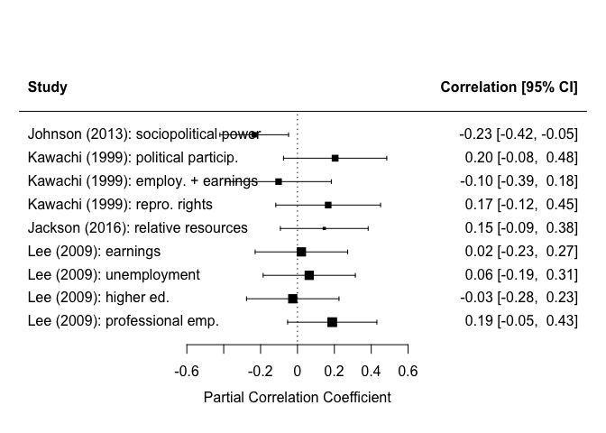

Mini-meta
================

Goal: write code to conduct a mini meta-regression using just a few of
our studies, as a proof of concept and to better understand how to work
with the data and use the relevant R packages.

<details>

<summary> Click to expand and see the initial data import and cleaning
steps & full table from the data extraction form. </summary>

``` r
library(tidyverse)
library(metafor)
library(clubSandwich)
library(robumeta)
#library(kableExtra) #--> might be helpful later for making nice tables
```

``` r
study_data = read.csv("mini-meta-practice-data.csv") %>% 
  janitor::clean_names(.) %>% 
  rowid_to_column(., "effect_size_id") %>% 
  mutate_at(., vars(all_of(c("decade_of_majority_of_data"))), factor) %>% 
  mutate_at(., vars(all_of(c("exposure_operationalization",
                             "outcome_operationalization",
                             "source_population",
                             "which_model_is_this_from_in_their_analysis_table",
                             "confounders",
                             "notes_about_measure_of_association_type"))), list(as.character)) %>% 
  rename(.,
         sample_size = sample_size_observations,
         SE = standard_deviation_error,
         MA_type = measure_of_association_type,
         MA_number = measure_of_association_number)

knitr::kable(study_data)
```

| effect\_size\_id | study\_id | authors                                               | publication\_date | title                                                                                       | decade\_of\_majority\_of\_data | survey\_or\_surveillance | ecological\_or\_cross\_level | exposure\_data\_source | exposure\_operationalization                                                                                                                                                             | exposure\_absolute\_relative\_or\_both | outcome\_data\_source                             | outcome\_operationalization                    | source\_population                                                         | unit\_of\_analysis | study\_design   | sample\_size | which\_model\_is\_this\_from\_in\_their\_analysis\_table | confounders                                                                                                                                                                                                                                     | MA\_type        | MA\_number | variance\_reported\_type |    SE | notes\_about\_measure\_of\_association\_type                                                                                                                                                                                                                                                                                                                                                                             |
| ---------------: | --------: | :---------------------------------------------------- | ----------------: | :------------------------------------------------------------------------------------------ | :----------------------------- | :----------------------- | :--------------------------- | :--------------------- | :--------------------------------------------------------------------------------------------------------------------------------------------------------------------------------------- | :------------------------------------- | :------------------------------------------------ | :--------------------------------------------- | :------------------------------------------------------------------------- | :----------------- | :-------------- | -----------: | :------------------------------------------------------- | :---------------------------------------------------------------------------------------------------------------------------------------------------------------------------------------------------------------------------------------------- | :-------------- | ---------: | :----------------------- | ----: | :----------------------------------------------------------------------------------------------------------------------------------------------------------------------------------------------------------------------------------------------------------------------------------------------------------------------------------------------------------------------------------------------------------------------- |
|                1 |        18 | Johnson, Richard R.                                   |              2013 | Rape and Gender Conflict in a Patriarchal State                                             | 2000                           | Surveillance             | Ecological                   | Census / gov’t         | Index: percentage of female state legislative reps, percentage of female-owned businesses, percentage of female-headed households, percentage of female law enforcement officers         | Relative                               | FBI (ex. UCR)                                     | Avg annual \# rapes reported to police / 1000  | Counties in Kansas                                                         | County             | Cross-sectional |          105 | Table 3                                                  | Concentrated disadvantage (including non-rape violent crime rates), presence of a rape crisis center, \# police officers per capita, percentage of the population that was female                                                               | Risk Difference |      0.024 | Standard error           | 0.010 | NOTE: in the text they say “to explore the multivariate effects of the exogenous variables on the logged reported rape rate of eachcounty, estimated using OLS regression” but in the variable list, they don’t take the log. I think this is OLS regression, using the log of count data: ln(y) = B0+B1\*x , but I don’t know what the coefficient represents. <http://cameron.econ.ucdavis.edu/racd/simplepoisson.pdf> |
|                2 |        19 | Kawachi I; Kennedy BP; Gupta V; Prothrow-Stith D      |              1999 | Women’s status and the health of women and men: a view from the States.                     | 1990                           | Surveillance             | Ecological                   | Census / gov’t         | Political participation: women’s voter registration, women’s voter turnout, representation in elected office, institutional resources for women                                          | Both/mix                               | CDC (ex. WISQ.)                                   | Age standardized homicide rates per 100k women | US                                                                         | State              | Cross-sectional |           50 | Table 2                                                  | Gini, Median house hold income, poverty rate                                                                                                                                                                                                    | Risk difference |    \-0.070 | Standard error           | 0.050 | Count data vs. 1stdev change in indicators                                                                                                                                                                                                                                                                                                                                                                               |
|                3 |        19 | Kawachi I; Kennedy BP; Gupta V; Prothrow-Stith D      |              1999 | Women’s status and the health of women and men: a view from the States.                     | 1990                           | Surveillance             | Ecological                   | Census / gov’t         | Employment and earnings: absolute earnings, wage gap, mgmt/professional percentage, labor force percentage                                                                               | Both/mix                               | CDC (ex. WISQ.)                                   | Age standardized homicide rates per 100k women | US                                                                         | State              | Cross-sectional |           50 | Table 3                                                  | Gini, Median house hold income, poverty rate                                                                                                                                                                                                    | Risk difference |      0.510 | Standard error           | 0.730 |                                                                                                                                                                                                                                                                                                                                                                                                                          |
|                4 |        19 | Kawachi I; Kennedy BP; Gupta V; Prothrow-Stith D      |              1999 | Women’s status and the health of women and men: a view from the States.                     | 1990                           | Surveillance             | Ecological                   | Census / gov’t         | Reproductive rights: 8 legislative/political indicators ie policies, including percent of counties with at least one abortion provider and whether governor or legislature is pro-choice | Both/mix                               | CDC (ex. WISQ.)                                   | Age standardized homicide rates per 100k women | US                                                                         | State              | Cross-sectional |           50 | Table 5                                                  | Gini, Median house hold income, poverty rate                                                                                                                                                                                                    | Risk difference |    \-0.170 | Standard error           | 0.150 |                                                                                                                                                                                                                                                                                                                                                                                                                          |
|                5 |        17 | Jackson, Aubrey L.                                    |              2016 | The Combined Effect of Women’s Neighborhood Resources and Collective Efficacy on IPV.       | 1990                           | Survey                   | Cross-level                  | Census / gov’t         | PCA/composite: percent employed pop, prof/managerial workers, & college grads who are women                                                                                              | Relative                               | Longitudinal Cohort Survey of the PHDCN (Chicago) | Severe past-year IPV victimization             | Female primary caregivers of children, married or cohabitating, in Chicago | Neighborhood       | Cross-sectional |           80 | Table 2 / Model 4                                        | Individual characteristics (age, race, marital status, social support, salary, relative salary to spouse, household size, residential stability) + other structural (concentrated disadvantage, residential stability, immigrant concentration) | Log OR          |    \-0.096 | Standard error           | 0.081 | NOTE: sample size was 2463 women / 80 neighborhoods, not sure what to do with cross-level sample size                                                                                                                                                                                                                                                                                                                    |
|                6 |        21 | Lee, Daniel R.; Hilinski, Carly M.; Clevenger, Shelly |              2009 | The Contributions of Female Independence and Gender Equality to Rape in Metropolitan Areas. | 2000                           | Surveillance             | Ecological                   | Census / gov’t         | Gender diff in earnings                                                                                                                                                                  | Relative                               | FBI (ex. UCR)                                     | ln(3-year average forcible rape rate)          | People from 75 of the 100 largest SMSAs                                    | City / MSA         | Cross-sectional |           75 | Table 3 / Model 4 / coef 4                               | Infant mortality rate, poverty rate, percent 18-24, percent 25-44, male:female ratio, percent black + social independence index (female divorce rate, female headed household rate, female self-employment rate)                                | Log RR          |      0.250 | Standard error           | 1.493 | “The dependent variable is the natural log of the three-year average forcible rape rate” –\> is this the log IRR?                                                                                                                                                                                                                                                                                                        |
|                7 |        21 | Lee, Daniel R.; Hilinski, Carly M.; Clevenger, Shelly |              2009 | The Contributions of Female Independence and Gender Equality to Rape in Metropolitan Areas. | 2000                           | Surveillance             | Ecological                   | Census / gov’t         | Gender diff in unemployment                                                                                                                                                              | Relative                               | FBI (ex. UCR)                                     | ln(3-year average forcible rape rate)          | People from 75 of the 100 largest SMSAs                                    | City / MSA         | Cross-sectional |           75 | Table 3 / Model 4 / coef 5                               | Same as above                                                                                                                                                                                                                                   | Log RR          |      0.001 | Standard error           | 0.002 |                                                                                                                                                                                                                                                                                                                                                                                                                          |
|                8 |        21 | Lee, Daniel R.; Hilinski, Carly M.; Clevenger, Shelly |              2009 | The Contributions of Female Independence and Gender Equality to Rape in Metropolitan Areas. | 2000                           | Surveillance             | Ecological                   | Census / gov’t         | Gender diff in Higher Ed                                                                                                                                                                 | Relative                               | FBI (ex. UCR)                                     | ln(3-year average forcible rape rate)          | People from 75 of the 100 largest SMSAs                                    | City / MSA         | Cross-sectional |           75 | Table 3 / Model 4 / coef 6                               | Same as above                                                                                                                                                                                                                                   | Log RR          |    \-0.001 | Standard error           | 0.005 |                                                                                                                                                                                                                                                                                                                                                                                                                          |
|                9 |        21 | Lee, Daniel R.; Hilinski, Carly M.; Clevenger, Shelly |              2009 | The Contributions of Female Independence and Gender Equality to Rape in Metropolitan Areas. | 2000                           | Surveillance             | Ecological                   | Census / gov’t         | Gender diff in Professional Employment                                                                                                                                                   | Relative                               | FBI (ex. UCR)                                     | ln(3-year average forcible rape rate)          | People from 75 of the 100 largest SMSAs                                    | City / MSA         | Cross-sectional |           75 | Table 3 / Model 4 / coef 7                               | Same as above                                                                                                                                                                                                                                   | Log RR          |      0.003 | Standard error           | 0.002 |                                                                                                                                                                                                                                                                                                                                                                                                                          |

</details>

<details>

<summary> DELETE THIS ONCE I’VE REPLACED THE FAKE DATA WITH REAL DATA
</summary>

## Made-up dataset, for easier practicing

``` r
set.seed(123)
replication_counts = c(3, 2, 1, 1, 1)

fake_data = tibble(
  es_id = 1001:1008,
  study_id = rep(1:5, replication_counts),
  authors = rep(c("Author1", "Author2", "Author3", "Author4", "Author1"), replication_counts),
  pub_date = as.character(rep(2001:2005, replication_counts)),
  unit_of_analysis = rep(c("City/MSA", "County", "Neighborhood", "County", "State"), replication_counts),
  setting = rep(c("Urban", "Rural", "Urban", "Rural", "USA"), replication_counts),
  outcome_data_source = rep(c("FBI", "Survey", "Survey", "Local PD", "FBI"), replication_counts),
  sample_size = rep(c(75, 100, 30, 150, 50), replication_counts),
  #num_predictors = c(??????), #number of predictors in the regression model
  result = rnorm(8, mean = 1.03, sd = 0.3),
  error = abs(rnorm(8, mean = 0.04, sd = 0.03)),
  label = c(": Edu", ": Employment", ": Gov't rep", ": IPV", ": Homicide", "", "", "")
)

knitr::kable(fake_data)
```

| es\_id | study\_id | authors | pub\_date | unit\_of\_analysis | setting | outcome\_data\_source | sample\_size |    result |     error | label        |
| -----: | --------: | :------ | :-------- | :----------------- | :------ | :-------------------- | -----------: | --------: | --------: | :----------- |
|   1001 |         1 | Author1 | 2001      | City/MSA           | Urban   | FBI                   |           75 | 0.8618573 | 0.0193944 | : Edu        |
|   1002 |         1 | Author1 | 2001      | City/MSA           | Urban   | FBI                   |           75 | 0.9609468 | 0.0266301 | : Employment |
|   1003 |         1 | Author1 | 2001      | City/MSA           | Urban   | FBI                   |           75 | 1.4976125 | 0.0767225 | : Gov’t rep  |
|   1004 |         2 | Author2 | 2002      | County             | Rural   | Survey                |          100 | 1.0511525 | 0.0507944 | : IPV        |
|   1005 |         2 | Author2 | 2002      | County             | Rural   | Survey                |          100 | 1.0687863 | 0.0520231 | : Homicide   |
|   1006 |         3 | Author3 | 2003      | Neighborhood       | Urban   | Survey                |           30 | 1.5445195 | 0.0433205 |              |
|   1007 |         4 | Author4 | 2004      | County             | Rural   | Local PD              |          150 | 1.1682749 | 0.0233248 |              |
|   1008 |         5 | Author1 | 2005      | State              | USA     | FBI                   |           50 | 0.6504816 | 0.0936074 |              |

</details>

## Step 1: Create a sample summary table of included studies

``` r
# choose what information to include
# condense to one line per study
# note the number of effects that that study contributed
# order alphabetically
```

## Step 2: Transform effect sizes into a uniform statistic

First, look at the information we have on these effect sizes:

``` r
knitr::kable(select(study_data,
                    study_id,
                    sample_size,
                    MA_type,
                    MA_number,
                    SE))
```

| study\_id | sample\_size | MA\_type        | MA\_number |    SE |
| --------: | -----------: | :-------------- | ---------: | ----: |
|        18 |          105 | Risk Difference |      0.024 | 0.010 |
|        19 |           50 | Risk difference |    \-0.070 | 0.050 |
|        19 |           50 | Risk difference |      0.510 | 0.730 |
|        19 |           50 | Risk difference |    \-0.170 | 0.150 |
|        17 |           80 | Log OR          |    \-0.096 | 0.081 |
|        21 |           75 | Log RR          |      0.250 | 1.493 |
|        21 |           75 | Log RR          |      0.001 | 0.002 |
|        21 |           75 | Log RR          |    \-0.001 | 0.005 |
|        21 |           75 | Log RR          |      0.003 | 0.002 |

**We are going to convert all effect sizes into partial corerlation
coefficients.**

<details>

<summary> Click for references, instructions, & code. </summary>

References:

  - Aloe & Thompson (2013):
    <https://www.journals.uchicago.edu/doi/10.5243/jsswr.2013.24>
  - Aloe & Becker (2012):
    <https://journals.sagepub.com/doi/10.3102/1076998610396901>
  - Aloe (2013):
    <https://www.tandfonline.com/doi/abs/10.1080/00221309.2013.853021>

From the `metafor` website’s documentation on the `escalc` function:

> To compute these measures, one needs to specify `ti` for the test
> statistics (i.e., t-tests) of the regression coefficient of interest,
> `ni` for the sample sizes of the studies, `mi` for the number of
> predictors in the regression models… The options for the measure
> argument are then: “PCOR” for the partial correlation coefficient…

For the majority of our studies, we will have:

  - Beta
  - Standard error
  - Number of predictors in the regression model
  - Sample size

This means we’ll need to convert effect sizes in two steps: (1) get the
t-test statistic using Beta & standard error, (2) use `escalc` to
compute a partial correlation coefficient.

*Note: for a handful of studies, they already provide partial
correlation coefficients. For others, they provide 2x2 tables or risk
differences. In these cases, we can use other `escalc` options to
convert between d-family and r-family effects (not shown here yet).*

``` r
# Step 1: get the t-test statistic
# Step 2: use `escalc` to compute partial correlation coefficients. add on to data table.
```

</details>

<br> Here is our standardized data, ready for analysis:

``` r
#knitr::kable(??)
```

*Note: We can see here that some effects are positive \[supporting the
amelioration hypothesis\] and others are negative \[supporting the
backlash hypothesis\]. Effects from study ?? have higher variance than
the rest, so later on in the forest plot we should expect to see them
have wider confidence intervals.*

## Build our regression model, conduct statistical tests, create plots

(Using the `metafor` and `clubsandwich` packages)

References:

1.  This working paper provides a very useful explanation and guide:
    <https://www.jepusto.com/#working-papers>
2.  This is a reference for the statistical motivation, from *Research
    Synthesis Methods*:
    <https://onlinelibrary.wiley.com/doi/abs/10.1002/jrsm.5>
3.  Documentation for `clubSandwich`:
    <https://cran.r-project.org/web/packages/clubSandwich/clubSandwich.pdf>
4.  Documentation for `metafor`:
    <https://wviechtb.github.io/metafor/reference/rma.mv.html>

**An inventory of choices we’re making to decide how to build the
meta-regression model:**

  - What type of model?
      - Multivariate/multi-level, becasuse some studies contributed
        multiple effect sizes (hence, `rma.mv`)
      - Random effects, because our studies represent a distribution of
        *different* true effects
  - What is the correlation structure between estimates from the same
    study?
      - We don’t know\! (not enough info provided per study) –\> so we
        estimate the fixed effects component as constant, rho = ?? (some
        references suggest `0.6`, some `0.8`, so we’ll think about it)
      - Since we might be wrong with the assumption above, we use Robust
        Variance Estimation (RVE) when building our model and conducting
        our statistical tests
  - What is the nested/heirarchcal structure of our data?
      - For now, it’s: `studies --> effect sizes`
      - Another option would be `"research group"/author --> studies -->
        effect sizes` (this is suggested when the same research group is
        looking at multiple different cohorts for different studies.
        there aren’t really “research groups”, although some authors
        frequently publish together or have contributed multiple papers
        to our analysis) *Note: If we want to do this, the supplementary
        materials here have some guidance in S3.1:
        <https://osf.io/nyv4u/>*

<!-- end list -->

``` r
# constant sampling correlation assumption
rho <- 0.6 #is this a good assumption for us? In other places it's 0.8....

# create a covariance matrix assuming constant sampling correlation (working model)
cov_matrix <- impute_covariance_matrix(
  vi = fake_data$error, #vector of variances
  cluster = fake_data$study_id,
  r = rho, #assuming constant. make sure we pick the right value.
  smooth_vi = FALSE #this is the default. how would we know if we want to smooth?
  #subgroup = fake_data$authors, #i *think* this is where we'd do heirarchical clustering. but not sure, so leaving it out for now
)

# fit random effects working model in metafor
multilevel_model <- rma.mv(
  # here I'm specificying a formula, rather than an argument for the Y, and for the moderators
  result ~ 0 + outcome_data_source + setting, #"use a no-intercept specificaiton so that coefficients represent avg effect sizes for the corresponding category" (pre-print p.23)
  V = cov_matrix,
  random = ~ 1 | study_id / es_id, #this designates the nested structure of the random effects. QUESTION: if we do heirarchical + clustered, how do we designate that?
  #sparse = TRUE, #this is about speeding up the process, so not sure if it's necessary. I left it out.
  #test= "t", #use t-tests instead of the default z. why would we want this? (I left it out.)
  data = fake_data
)
```

### Meta-regression output:

``` r
multilevel_model # Note that this reports model-based (not robust) standard errors
```

    ## 
    ## Multivariate Meta-Analysis Model (k = 8; method: REML)
    ## 
    ## Variance Components:
    ## 
    ##             estim    sqrt  nlvls  fixed          factor 
    ## sigma^2.1  0.0053  0.0728      5     no        study_id 
    ## sigma^2.2  0.0363  0.1905      8     no  study_id/es_id 
    ## 
    ## Test for Residual Heterogeneity:
    ## QE(df = 3) = 8.1567, p-val = 0.0429
    ## 
    ## Test of Moderators (coefficients 1:5):
    ## QM(df = 5) = 93.2083, p-val < .0001
    ## 
    ## Model Results:
    ## 
    ##                              estimate      se    zval    pval    ci.lb   ci.ub 
    ## outcome_data_sourceFBI         0.4898  0.4356  1.1244  0.2608  -0.3640  1.3437 
    ## outcome_data_sourceLocal PD    1.1683  0.2548  4.5858  <.0001   0.6690  1.6676 
    ## outcome_data_sourceSurvey      1.0599  0.2541  4.1713  <.0001   0.5619  1.5579 
    ## settingUrban                   0.4846  0.3866  1.2536  0.2100  -0.2731  1.2424 
    ## settingUSA                     0.1606  0.5701  0.2818  0.7781  -0.9566  1.2779 
    ##  
    ## outcome_data_sourceFBI 
    ## outcome_data_sourceLocal PD  *** 
    ## outcome_data_sourceSurvey    *** 
    ## settingUrban 
    ## settingUSA 
    ## 
    ## ---
    ## Signif. codes:  0 '***' 0.001 '**' 0.01 '*' 0.05 '.' 0.1 ' ' 1

### T-tests for each variable:

``` r
#these tests are RVE based and are robust to mispecification of the variances and covariances
coef_test(
  obj = multilevel_model, #estimation model above
  #cluster = fake_data$study_id, #define cluster IDs (not needed, already specified in model)
  vcov = "CR2" #estimation method (CR2 is best)
)
```

    ##                         Coef. Estimate       SE   t-stat d.f. p-val (Satt) Sig.
    ## 1      outcome_data_sourceFBI    0.490 0.176778    2.771    1         0.22     
    ## 2 outcome_data_sourceLocal PD    1.168 0.000000      Inf  NaN           NA   NA
    ## 3   outcome_data_sourceSurvey    1.060 0.000216 4898.071    1       <0.001  ***
    ## 4                settingUrban    0.485 0.000216 2239.726    1       <0.001  ***
    ## 5                  settingUSA    0.161 0.176778    0.909    1         0.53

### Confidence intervals for those tests:

``` r
conf_int(
  obj = multilevel_model,
  vcov = "CR2"
)
```

    ##                          Coef Estimate       SE d.f. Lower 95% CI Upper 95% CI
    ## 1      outcome_data_sourceFBI    0.490 0.176778    1       -1.736        2.716
    ## 2 outcome_data_sourceLocal PD    1.168 0.000000  NaN          NaN          NaN
    ## 3   outcome_data_sourceSurvey    1.060 0.000216    1        1.057        1.063
    ## 4                settingUrban    0.485 0.000216    1        0.482        0.487
    ## 5                  settingUSA    0.161 0.176778    1       -2.065        2.386

*Note: Here we might interpret one of these results as ???? \[of course,
this isn’t meaningful right now with just 4
studies\!\]*

### Funnel plot: publication bias

``` r
# For the funnel and forest plots, it makes more sense (to me) to plot from a regression model that doesn't include moderators.
no_moderators <- rma.mv(
  result ~ 1,
  V = cov_matrix,
  random = ~ 1 | study_id / es_id, #this designates the nested structure of the random effects. QUESTION: if we do heirarchical + clustered, how do we designate that?
  data = fake_data
)

funnel(no_moderators)
```

<!-- -->

``` r
ranktest(no_moderators)
```

    ## 
    ## Rank Correlation Test for Funnel Plot Asymmetry
    ## 
    ## Kendall's tau = 0.1429, p = 0.7195

``` r
# QUESTION1: should we also do a statistical test for publication bias? If so, is it this one?
# QUESTION2: is this still appropriately down-weighting estimates within the same study? I don't think so, because each dot just shows up... but maybe it doesn't matter?
```

### Forest plot\!

*Note: there are a lot of [really neat
options](https://wviechtb.github.io/metafor/reference/forest.rma.html)
on the metafor website for forest plots\! The very last example has the
nested structure (which fits our data), but is also the least beautiful.
There might be a way to use some of the different preferences and
options to make ours nice…*

``` r
forest(
  x = rma.mv(result ~ 1, V = cov_matrix, random = ~ 1 | study_id / es_id, data = fake_data,
             slab=paste0(authors, " (", pub_date, ")", label)),
  annotate = TRUE, #does this add numbers on to the plot?
  addfit = FALSE, #TRUE would add in one summary measure for the whole thing
  #addpred = FALSE, #the bounds of the prediction interval (might not be meaningful)
  showweights = FALSE, #TRUE would be interesting to see, but the documentation warns the weights shown don't reflect the complexity from the model with rma.mv
  #level=x$level, #this is about the CI level, which I don't think is included anywhere in our model? even though that's where the default is taken from
  refline = 1, #I put this at 1 to show the relation to the null. change if not using ORs
  #digits=2L, #rounding for annotations
  #xlab, #label for the x-axis
  #slab = fake_data$study_id, #study labels. supress with NA, or add column
  #ilab, #optional extra label for studies
  #ilab.xpos, ilab.pos,
  order = c(1:3, 8, 4:7), #specify how the studies should be ordered, including obs (effect sizes), prec (variances), or a vector with the order
  header = c("Study (& specific effect)", "Estimate [95% CI]") #can pass in a character vector for left & right headings, or TRUE
)
```

<!-- -->
